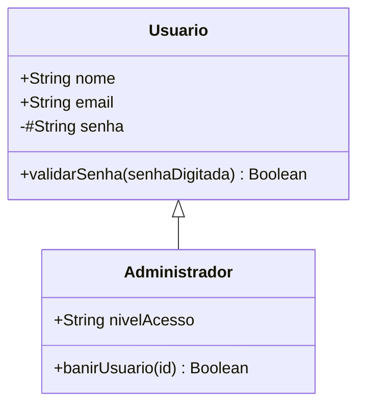

# Aula 07 — POO Avançado e Modelagem UML

## <i className="fa-solid fa-bullseye" style={{ color: 'var(--ifm-color-primary)' }}></i> Objetivo da aula

Aprofundar os pilares avançados da Programação Orientada a Objetos (POO), aplicando **Encapsulamento** com atributos privados (`#`), métodos **Getters e Setters**, **Herança (`extends`/`super`)** e interpretando/desenhando **Diagramas de Classe UML**.

## <i className="fa-solid fa-book" style={{ color: 'var(--ifm-color-primary)' }}></i> Conteúdos trabalhados

- Encapsulamento e proteção de dados com campos privados (`#`).
- Métodos de acesso: `get` (leitura) e `set` (validação e escrita).
- Herança de classes com `extends` e a chamada `super()`.
- Sobrescrita de métodos (Method Overriding).
- Introdução a Diagramas de Classe UML (Unified Modeling Language).

## <i className="fa-solid fa-brain" style={{ color: 'var(--ifm-color-primary)' }}></i> Explicação

### 1. Encapsulamento e Campos Privados (`#`)
**Encapsulamento** é o pilar da POO que protege o estado interno de um objeto contra alterações indevidas ou não autorizadas vindas de fora da classe.

No JavaScript moderno, declaramos atributos ou métodos privados utilizando o caractere `#` antes do nome:

```javascript
class ContaCorrente {
  // Atributo privado (não acessível fora da classe)
  #saldo = 0;
  #senha;

  constructor(titular, senha) {
    this.titular = titular; // Atributo público
    this.#senha = senha;
  }

  depositar(valor) {
    if (valor > 0) {
      this.#saldo += valor;
    }
  }

  // Getter para leitura segura do saldo
  get saldo() {
    return this.#saldo;
  }
}

const conta = new ContaCorrente('Maria', '1234');
conta.depositar(500);
console.log(conta.saldo); // 500 (Acessado via Getter)
// console.log(conta.#saldo); // Erro de Sintaxe! O campo privado não é acessível fora da classe.
```

---

### 2. Herança (`extends` e `super`)
A **Herança** permite criar novas classes baseadas em classes existentes, reaproveitando seus atributos e métodos.

- **Classe Pai / Superclasse:** A classe base geral.
- **Classe Filha / Subclasse:** A classe especializada que herda com `extends`.
- **`super()`:** Executa o construtor da classe pai.

```javascript
// Classe Pai
class Funcionario {
  constructor(nome, salarioBase) {
    this.nome = nome;
    this.salarioBase = salarioBase;
  }

  calcularSalario() {
    return this.salarioBase;
  }
}

// Classe Filha especializada
class Gerente extends Funcionario {
  constructor(nome, salarioBase, bonus) {
    super(nome, salarioBase); // Chama o construtor de Funcionario
    this.bonus = bonus;
  }

  // Sobrescrita de método
  calcularSalario() {
    return this.salarioBase + this.bonus;
  }
}
```

---

### 3. Diagrama de Classes UML (Unified Modeling Language)
A **UML** é a linguagem padrão da indústria para desenhar a arquitetura de sistemas orientados a objetos antes da codificação.

#### Notação Básica de Atributos e Métodos em UML:
- `+` representa elemento **Público** (`public`)
- `-` representa elemento **Privado** (`private / #`)
- `#` representa elemento **Protegido** (`protected`)

#### Exemplo em Diagrama Mermaid:



---

## <i className="fa-solid fa-laptop-code" style={{ color: 'var(--ifm-color-primary)' }}></i> Exemplo prático

### Sistema de Gestão de Usuários e Permissões (RBAC)

Vamos implementar a herança e o encapsulamento com **ES Modules**.

#### Pasta do Projeto:
```
sistema-usuarios/
├── models/
│   ├── Usuario.js
│   └── Administrador.js
├── app.js
└── package.json
```

#### Arquivo 1: `models/Usuario.js`
```javascript
// models/Usuario.js
export default class Usuario {
  #senha; // Atributo privado

  constructor(id, nome, email, senha) {
    this.id = id;
    this.nome = nome;
    this.email = email;
    this.#senha = senha;
  }

  autenticar(senhaDigitada) {
    return this.#senha === senhaDigitada;
  }

  exibirResumo() {
    return `[ID: ${this.id}] ${this.nome} (${this.email})`;
  }
}
```

#### Arquivo 2: `models/Administrador.js`
```javascript
// models/Administrador.js
import Usuario from './Usuario.js';

export default class Administrador extends Usuario {
  constructor(id, nome, email, senha, departamento) {
    super(id, nome, email, senha);
    this.departamento = departamento;
  }

  // Sobrescrita do método
  exibirResumo() {
    return `${super.exibirResumo()} | 🛡️ ADMIN - Depto: ${this.departamento}`;
  }

  executarBackupSistema() {
    console.log(`⚡ [ADMIN: ${this.nome}] Backup do banco de dados iniciado...`);
  }
}
```

#### Arquivo 3: `app.js`
```javascript
// app.js
import Usuario from './models/Usuario.js';
import Administrador from './models/Administrador.js';

console.log("==========================================");
console.log("🛡️ SISTEMA DE POO AVANÇADO - USUÁRIOS & ADMINS");
console.log("==========================================");

const userComum = new Usuario(1, 'Lucas Lima', 'lucas@email.com', 'user123');
const admin = new Administrador(2, 'Carla Mendes', 'carla@senai.br', 'admin987', 'T.I.');

console.log(userComum.exibirResumo());
console.log(`Senha correta? ${userComum.autenticar('user123') ? 'Sim' : 'Não'}`);

console.log("\n" + admin.exibirResumo());
admin.executarBackupSistema();
```

#### Arquivo 4: `package.json`
```json
{
  "name": "poo-avancado",
  "version": "1.0.0",
  "type": "module",
  "scripts": {
    "start": "node app.js"
  }
}
```

---

## <i className="fa-solid fa-flask" style={{ color: 'var(--ifm-color-primary)' }}></i> Atividade prática

### Modelagem do Sistema de Veículos da Frota

**Objetivo:** Criar um diagrama de classes e codificar uma hierarquia de herança com campos privados.

**Instruções:**
1. Crie uma pasta `atividade-aula-07` com `"type": "module"` no `package.json`.
2. Crie a classe base `Veiculo.js` na pasta `models/`:
   - Atributos públicos: `marca`, `modelo`, `ano`.
   - Atributo privado: `#quilometragem` (inicializado no `constructor`).
   - Getter `quilometragem` para leitura do atributo privado.
   - Método `rodar(km)` que incrementa a `#quilometragem` caso `km` seja maior que zero.
3. Crie a subclasse `CarroEletrico.js` que herda de `Veiculo`:
   - Atributo próprio: `autonomiaBateria` (em km).
   - Método `carregarBateria()` que exibe mensagem de recarga.
   - Sobrescreva o método `exibirInfo()` incluindo os dados da bateria.
4. No arquivo `index.js`, instancie um `CarroEletrico`, faça-o rodar 150 km, recarregue a bateria e exiba a info completa.
5. Execute com `npm start`.

---

## <i className="fa-solid fa-list-check" style={{ color: 'var(--ifm-color-primary)' }}></i> Checklist de entrega

- [ ] O aluno aplicou o encapsulamento utilizando o caractere `#` para atributos privados.
- [ ] O aluno utilizou métodos Getters para permitir leitura segura de dados privados.
- [ ] O aluno aplicou Herança utilizando a palavra-chave `extends`.
- [ ] O aluno invocou o construtor pai utilizando o método `super()`.
- [ ] O aluno compreendeu como representar classes, visibilidades (`+`/`-`) e herança em diagramas UML.

---

## <i className="fa-solid fa-rocket" style={{ color: 'var(--ifm-color-primary)' }}></i> Agora é com você!

O encapsulamento e a herança são os mecanismos essenciais que garantem que grandes plataformas consigam crescer com segurança e sem duplicação de lógica.

**Desafio Extra:** Crie um Setter para um atributo privado `#limiteCredito` que só aceite alterações se o novo limite for maior que zero e menor que R$ 10.000,00!
