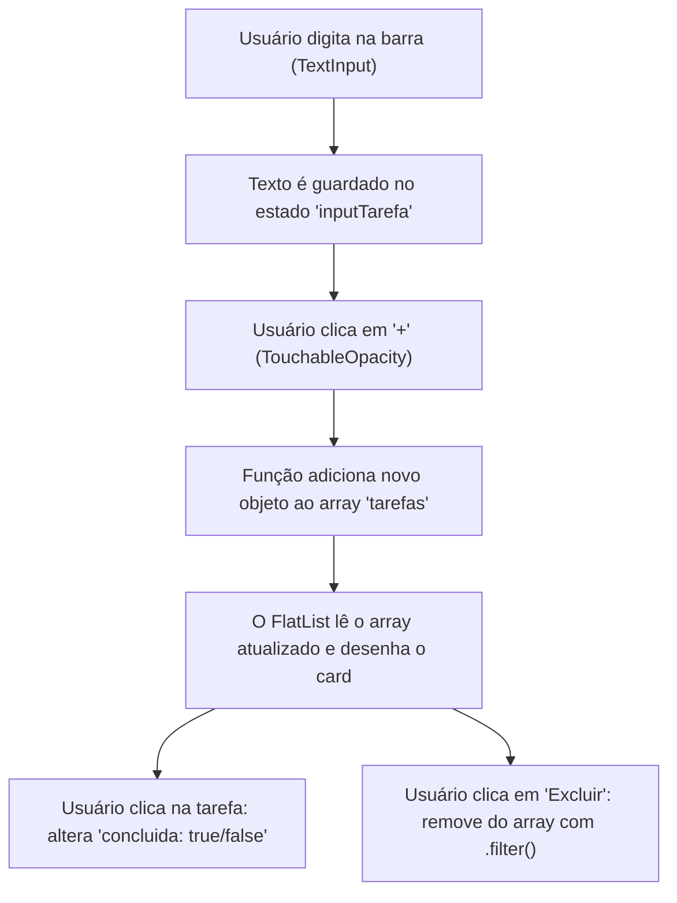

# Aula 08 — Prática: App de Lista de Tarefas

## <i className="fa-solid fa-bullseye" style={{ color: 'var(--ifm-color-primary)' }}></i> Objetivo da aula

Consolidar todos os conceitos de desenvolvimento mobile aprendidos até aqui (componentes, estilização com StyleSheet, manipulação de estados com `useState`, listas de alta performance com `FlatList` e renderizações condicionais) criando um aplicativo de **Lista de Tarefas (To-Do List)** completo, com criação, marcação e exclusão de itens em tempo real.

## <i className="fa-solid fa-book" style={{ color: 'var(--ifm-color-primary)' }}></i> Conteúdos trabalhados

- Integração total de componentes e layouts flexíveis.
- Lógica de adicionar itens a um array no estado (**Create**).
- Listagem dinâmica e performática (**Read**).
- Alteração condicional de propriedades de objetos dentro de um array (**Update**).
- Remoção de itens de um array no estado utilizando o método `.filter()` (**Delete**).
- Exibição de painéis estatísticos dinâmicos.

## <i className="fa-solid fa-brain" style={{ color: 'var(--ifm-color-primary)' }}></i> Explicação

Parabéns por chegar até aqui! Nas primeiras 7 semanas de curso, você aprendeu cada engrenagem isolada do desenvolvimento React Native. Hoje, nós juntaremos todas elas para construir o projeto clássico e mais importante do aprendizado de desenvolvimento de software: o **To-Do List (Lista de Tarefas)**.

Diferente das aulas anteriores, esta aula é **100% prática**. Focaremos em entender o ciclo completo de um dado dentro do aplicativo:



### Principais Lógicas que implementaremos no Estado:

#### 1. Adicionar uma nova tarefa (Sem mutar o estado diretamente)
No React, nós nunca devemos fazer `tarefas.push(novaTarefa)`. Isso altera o array original de forma "escondida" e impede que a tela seja atualizada. Em vez disso, usamos o operador de espalhamento (*spread operator*) para criar uma lista totalmente nova contendo os itens antigos mais o novo:
```javascript
setTarefas([...tarefas, novaTarefa]);
```

#### 2. Marcar/Desmarcar como concluída
Para marcar uma tarefa como feita, passamos pelo array inteiro procurando o ID correspondente. Quando achamos, invertemos o valor de `concluida` (de `false` para `true`, ou vice-versa):
```javascript
const novasTarefas = tarefas.map(t => t.id === id ? { ...t, concluida: !t.concluida } : t);
setTarefas(novasTarefas);
```

#### 3. Remover uma tarefa
Para excluir um item da lista, geramos um novo array filtrando e excluindo aquele que possui o ID selecionado:
```javascript
const tarefasRestantes = tarefas.filter(t => t.id !== id);
setTarefas(tarefasRestantes);
```

## <i className="fa-solid fa-laptop-code" style={{ color: 'var(--ifm-color-primary)' }}></i> Exemplo prático (O Código do Aplicativo)

Substitua todo o conteúdo do seu `App.js` por este aplicativo completo e de alto nível visual. Leia atentamente as funções de lógica interna e as regras CSS no StyleSheet:

```javascript
import React, { useState } from 'react';
import { View, Text, TextInput, TouchableOpacity, FlatList, StyleSheet, Alert } from 'react-native';

export default function App() {
  const [tarefas, setTarefas] = useState([]);
  const [novaTarefa, setNovaTarefa] = useState('');

  // 1. ADICIONAR TAREFA
  const adicionarTarefa = () => {
    if (novaTarefa.trim() === '') {
      Alert.alert('Atenção', 'Digite um nome para a tarefa antes de adicionar!');
      return;
    }

    const item = {
      id: Date.now().toString(), // Gera um ID único baseado na hora atual
      texto: novaTarefa,
      concluida: false
    };

    setTarefas([...tarefas, item]);
    setNovaTarefa(''); // Limpa o input de texto
  };

  // 2. ALTERNAR CONCLUÍDA / PENDENTE
  const alternarStatus = (id) => {
    const atualizadas = tarefas.map(t => 
      t.id === id ? { ...t, concluida: !t.concluida } : t
    );
    setTarefas(atualizadas);
  };

  // 3. EXCLUIR TAREFA
  const excluirTarefa = (id) => {
    const restantes = tarefas.filter(t => t.id !== id);
    setTarefas(restantes);
  };

  // 4. ESTATÍSTICAS
  const totalTarefas = tarefas.length;
  const concluidas = tarefas.filter(t => t.concluida).length;

  return (
    <View style={estilos.telaGeral}>
      <Text style={estilos.titulo}>Minhas Metas 🚀</Text>
      
      {/* CARD DE ESTATÍSTICAS */}
      <View style={estilos.cardEstatisticas}>
        <View>
          <Text style={estilos.tituloEstatisticas}>Progresso Diário</Text>
          <Text style={estilos.valorEstatisticas}>
            {totalTarefas > 0 ? `${concluidas} de ${totalTarefas} concluídas` : 'Sem tarefas pendentes'}
          </Text>
        </View>
        <Text style={estilos.porcentagem}>
          {totalTarefas > 0 ? `${Math.round((concluidas / totalTarefas) * 100)}%` : '0%'}
        </Text>
      </View>

      {/* ÁREA DE INPUT E BOTÃO ADICIONAR */}
      <View style={estilos.areaInput}>
        <TextInput 
          style={estilos.input}
          placeholder="Adicione uma nova tarefa..."
          placeholderTextColor="#64748B"
          value={novaTarefa}
          onChangeText={setNovaTarefa}
        />
        <TouchableOpacity style={estilos.botaoAdicionar} onPress={adicionarTarefa}>
          <Text style={estilos.textoBotaoAdicionar}>+</Text>
        </TouchableOpacity>
      </View>

      {/* LISTA DE TAREFAS */}
      <FlatList 
        data={tarefas}
        keyExtractor={item => item.id}
        renderItem={({ item }) => (
          <View style={estilos.cardTarefa}>
            {/* Clique no texto/checkbox para alternar status */}
            <TouchableOpacity 
              style={estilos.areaCliqueTarefa} 
              onPress={() => alternarStatus(item.id)}
            >
              {/* Checkbox circular customizada com StyleSheet */}
              <View style={[estilos.checkbox, item.concluida && estilos.checkboxConcluida]}>
                {item.concluida && <Text style={estilos.checkSymbol}>✓</Text>}
              </View>

              <Text style={[estilos.textoTarefa, item.concluida && estilos.textoTarefaConcluida]}>
                {item.texto}
              </Text>
            </TouchableOpacity>

            {/* Botão de Excluir */}
            <TouchableOpacity 
              style={estilos.botaoExcluir} 
              onPress={() => excluirTarefa(item.id)}
            >
              <Text style={estilos.textoExcluir}>✕</Text>
            </TouchableOpacity>
          </View>
        )}
        ItemSeparatorComponent={() => <View style={estilos.divisor} />}
        ListEmptyComponent={() => (
          <View style={estilos.containerVazio}>
            <Text style={estilos.emojiVazio}>☕</Text>
            <Text style={estilos.textoVazio}>Nenhuma tarefa cadastrada.</Text>
            <Text style={estilos.subtextoVazio}>Aproveite para relaxar ou crie novas metas!</Text>
          </View>
        )}
        contentContainerStyle={estilos.listaContainer}
      />
    </View>
  );
}

const estilos = StyleSheet.create({
  telaGeral: {
    flex: 1,
    backgroundColor: '#0F172A',
    paddingTop: 60,
    paddingHorizontal: 20,
  },
  titulo: {
    fontSize: 26,
    fontWeight: 'bold',
    color: '#F8FAFC',
    marginBottom: 20,
  },
  cardEstatisticas: {
    backgroundColor: '#1E293B',
    borderRadius: 16,
    padding: 20,
    flexDirection: 'row',
    justifyContent: 'space-between',
    alignItems: 'center',
    marginBottom: 24,
    borderWidth: 1,
    borderColor: '#334155',
  },
  tituloEstatisticas: {
    color: '#94A3B8',
    fontSize: 14,
    marginBottom: 4,
  },
  valorEstatisticas: {
    color: '#F8FAFC',
    fontSize: 16,
    fontWeight: 'bold',
  },
  porcentagem: {
    color: '#3B82F6',
    fontSize: 32,
    fontWeight: 'bold',
  },
  areaInput: {
    flexDirection: 'row',
    gap: 12,
    marginBottom: 24,
  },
  input: {
    flex: 1,
    height: 55,
    backgroundColor: '#1E293B',
    borderRadius: 12,
    paddingHorizontal: 16,
    color: '#F8FAFC',
    fontSize: 16,
    borderWidth: 1,
    borderColor: '#334155',
  },
  botaoAdicionar: {
    width: 55,
    height: 55,
    borderRadius: 12,
    backgroundColor: '#3B82F6',
    justifyContent: 'center',
    alignItems: 'center',
  },
  textoBotaoAdicionar: {
    color: '#FFFFFF',
    fontSize: 24,
    fontWeight: 'bold',
  },
  listaContainer: {
    paddingBottom: 40,
  },
  cardTarefa: {
    flexDirection: 'row',
    justifyContent: 'space-between',
    alignItems: 'center',
    backgroundColor: '#1E293B',
    borderRadius: 12,
    paddingHorizontal: 16,
    paddingVertical: 14,
    borderWidth: 1,
    borderColor: '#334155',
  },
  areaCliqueTarefa: {
    flexDirection: 'row',
    alignItems: 'center',
    flex: 1,
  },
  checkbox: {
    width: 22,
    height: 22,
    borderRadius: 11,
    borderWidth: 2,
    borderColor: '#64748B',
    marginRight: 12,
    justifyContent: 'center',
    alignItems: 'center',
  },
  checkboxConcluida: {
    backgroundColor: '#10B981',
    borderColor: '#10B981',
  },
  checkSymbol: {
    color: '#FFFFFF',
    fontSize: 12,
    fontWeight: 'bold',
  },
  textoTarefa: {
    color: '#F8FAFC',
    fontSize: 15,
    flex: 1,
  },
  textoTarefaConcluida: {
    color: '#64748B',
    textDecorationLine: 'line-through', // Efeito riscado no texto
  },
  botaoExcluir: {
    width: 32,
    height: 32,
    borderRadius: 8,
    backgroundColor: '#EF444420', // Vermelho bem clarinho/transparente
    justifyContent: 'center',
    alignItems: 'center',
  },
  textoExcluir: {
    color: '#EF4444',
    fontSize: 14,
    fontWeight: 'bold',
  },
  divisor: {
    height: 8, // Espaçamento entre as tarefas
  },
  containerVazio: {
    alignItems: 'center',
    marginTop: 40,
  },
  emojiVazio: {
    fontSize: 48,
    marginBottom: 12,
  },
  textoVazio: {
    color: '#F8FAFC',
    fontSize: 16,
    fontWeight: 'bold',
    marginBottom: 4,
  },
  subtextoVazio: {
    color: '#64748B',
    fontSize: 14,
    textAlign: 'center',
  },
});
```

## <i className="fa-solid fa-flask" style={{ color: 'var(--ifm-color-primary)' }}></i> Atividade prática

Abra o seu aplicativo `meu-primeiro-app` no VS Code. Vamos expandir o To-Do List transformando-o em um **Gerenciador de Hábitos Diários com Prioridades (Habit Tracker)**!
1. Crie o aplicativo com a base do To-Do List acima.
2. Adicione um **Seletor de Nível de Prioridade** acima ou abaixo do campo de texto de adicionar. O seletor pode ser composto por 3 botões simples lado a lado: "Alta", "Média" e "Baixa".
3. Quando o usuário clicar em um botão de prioridade, salve essa seleção no estado (ex: `prioridadeSelecionada`).
4. Ao clicar no botão de adicionar (`+`), crie a nova tarefa contendo o campo extra `prioridade` correspondente à selecionada.
5. Estilize dinamicamente o card de cada tarefa de acordo com a prioridade cadastrada:
   - Se for **Alta**: Desenhe uma pequena borda lateral esquerda grossa e vermelha (`#EF4444`) no card da tarefa.
   - Se for **Média**: Desenhe uma borda lateral esquerda amarela (`#F59E0B`).
   - Se for **Baixa**: Desenhe uma borda lateral esquerda cinza ou azul.

## <i className="fa-solid fa-list-check" style={{ color: 'var(--ifm-color-primary)' }}></i> Checklist de entrega

- [ ] É possível adicionar novas tarefas que aparecem de forma instantânea na lista.
- [ ] A lista é renderizada utilizando o componente de alta performance `<FlatList>`.
- [ ] Ao clicar em uma tarefa, o seu status (concluído/pendente) altera reativamente mudando o estilo visual (riscado).
- [ ] Ao clicar no botão de excluir, o item é excluído da lista e a contagem de tarefas no painel se atualiza.
- [ ] As tarefas possuem o diferencial de Prioridades (Alta, Média, Baixa) com estilizações dinâmicas e contornos laterais corretos.

## <i className="fa-solid fa-rocket" style={{ color: 'var(--ifm-color-primary)' }}></i> Agora é com você!

Adicione diferenciais incríveis no seu app para impressionar:
- **Confirmação antes de Excluir:** Evite exclusões acidentais! Quando o usuário clicar no botão de excluir (`✕`), dispare um pop-up de confirmação `Alert.alert` perguntando *"Tem certeza que deseja excluir esta tarefa?"*. Só exclua o item da lista se o usuário clicar no botão de confirmação "Sim".
- **Bloqueio de Duplicados:** Na função de adicionar, faça uma validação rápida: se a tarefa digitada já existir exatamente igual na lista de tarefas, impeça o cadastro e avise o usuário que a tarefa já foi criada!
- **Limpar Toda a Lista:** Crie um botão condicional elegante no cabeçalho ou rodapé chamado "Limpar Tudo" que só aparece se houver pelo menos 1 tarefa cadastrada. Ao clicar nele, resete a lista inteira de uma vez.

