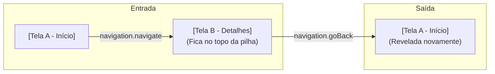

# Aula 09 — Introdução ao React Navigation

## <i className="fa-solid fa-bullseye" style={{ color: 'var(--ifm-color-primary)' }}></i> Objetivo da aula

Compreender o funcionamento da navegação multi-telas em dispositivos móveis e aprender a instalar, configurar e estruturar rotas em pilha (**Stack Navigation**) utilizando a biblioteca oficial do ecossistema, o **React Navigation**.

## <i className="fa-solid fa-book" style={{ color: 'var(--ifm-color-primary)' }}></i> Conteúdos trabalhados

- O conceito de navegação no mobile: A metáfora da **Pilha (Stack)**.
- Instalação dos pacotes fundamentais do **React Navigation** no ecossistema Expo.
- O contêiner de rotas global: **`<NavigationContainer>`**.
- Criando roteamento em pilha com **`createNativeStackNavigator`**.
- Efetuando transições programáticas usando o objeto **`navigation.navigate`** e **`navigation.goBack`**.

## <i className="fa-solid fa-brain" style={{ color: 'var(--ifm-color-primary)' }}></i> Explicação

### Como funciona a Navegação no Mobile?
Na Web, a navegação é baseada em caminhos de URLs digitados na barra do navegador (ex: `site.com/inicio`, `site.com/perfil`). 

No celular, **não existem URLs expostas**. A navegação mobile funciona como uma **Pilha de Telas (Stack)**. Pense nela como uma pilha de pratos na cozinha:

*   **Abertura do App:** O aplicativo inicia colocando a primeira tela (**Tela A - Início**) na base da pilha.
*   **Avançar:** Quando o usuário clica em um produto, o app empilha a nova tela (**Tela B - Detalhes**) por cima da Tela A. O usuário agora só enxerga a Tela B.
*   **Voltar:** Quando o usuário clica no botão "Voltar" (ou faz o gesto de arrastar o dedo do canto esquerdo da tela para o centro), o aplicativo **desempilha** (remove) a Tela B do topo. Ela é destruída, e a Tela A (que estava embaixo guardada) é revelada novamente exatamente no estado em que estava.



---

### Instalação no Expo (Passo a Passo)

Para usar a navegação nos nossos projetos, precisamos instalar a biblioteca oficial. Abra o terminal do VS Code e execute estes **dois comandos rápidos**:

#### 1. Instalar o núcleo da navegação e dependências nativas do Expo:
```bash
npm install @react-navigation/native
```
```bash
npx expo install react-native-screens react-native-safe-area-context
```

#### 2. Instalar o Roteador de Pilhas Nativo (Native Stack):
```bash
npm install @react-navigation/native-stack
```

*Pronto! Nosso ambiente agora está pronto para criar múltiplas telas.*

---

### Os Componentes da Navegação em Pilha

Para criar nossa pilha, primeiro importamos as ferramentas e instanciamos o navegador:

```javascript
import { NavigationContainer } from '@react-navigation/native';
import { createNativeStackNavigator } from '@react-navigation/native-stack';

const Stack = createNativeStackNavigator();
```

O objeto `Stack` criado nos dá acesso a dois componentes essenciais:
*   **`NavigationContainer`**: O wrapper que gerencia o estado da navegação global do aplicativo. Só pode haver **um** deste em todo o projeto, geralmente no seu `App.js`.
*   **`Stack.Navigator`**: O componente que define as configurações da pilha (como cabeçalhos, animações de transição e qual tela abrir primeiro).
*   **`Stack.Screen`**: Define uma rota individual. Ela precisa de um `name` (identificador da tela) e do `component` (a função/tela que será aberta).

#### Como navegar programaticamente?
Qualquer componente de tela cadastrado dentro de `<Stack.Screen>` recebe automaticamente em suas propriedades uma prop especial chamada **`navigation`**. Nós a usamos para transicionar na pilha:
*   Para avançar: `navigation.navigate('NomeDaTelaDestino')`.
*   Para voltar ao nível anterior: `navigation.goBack()`.

## <i className="fa-solid fa-laptop-code" style={{ color: 'var(--ifm-color-primary)' }}></i> Exemplo prático

Seguindo nossa diretriz de organização, podemos codificar **múltiplas telas dentro de um único arquivo `App.js`** declarando as funções de tela logo no início e montando o roteador na função padrão exportada.

Substitua todo o conteúdo do seu `App.js` por esta **Transição de Telas Premium com Efeito Pilha**:

```javascript
import React from 'react';
import { View, Text, StyleSheet, TouchableOpacity } from 'react-native';
import { NavigationContainer } from '@react-navigation/native';
import { createNativeStackNavigator } from '@react-navigation/native-stack';

// 1. TELA A - INÍCIO (HOME)
function TelaInicio({ navigation }) {
  return (
    <View style={estilos.containerHome}>
      <View style={estilos.cardGlow}>
        <Text style={estilos.emoji}>🛸</Text>
        <Text style={estilos.tituloHome}>Portal Antigravitacional</Text>
        <Text style={estilos.subtituloHome}>Bem-vindo ao espaço da navegação mobile em pilha.</Text>

        <TouchableOpacity 
          style={estilos.botaoNavegar}
          onPress={() => navigation.navigate('Detalhes')} // Empilha a tela de Detalhes
        >
          <Text style={estilos.textoBotao}>Acessar Cabine de Controle</Text>
        </TouchableOpacity>
      </View>
    </View>
  );
}

// 2. TELA B - DETALHES (DETAILS)
function TelaDetalhes({ navigation }) {
  return (
    <View style={estilos.containerDetalhes}>
      <Text style={estilos.tituloDetalhes}>Painel de Controle ⚡</Text>
      <Text style={estilos.textoDetalhes}>
        Você acabou de empilhar uma nova tela! Note como o React Navigation cria automaticamente 
        um botão de voltar no canto superior esquerdo da barra de navegação de forma nativa.
      </Text>

      <View style={estilos.statusBox}>
        <Text style={estilos.textoStatus}>Gravidade: 0.0m/s² (Estável)</Text>
      </View>

      <TouchableOpacity 
        style={estilos.botaoVoltar}
        onPress={() => navigation.goBack()} // Desempilha esta tela
      >
        <Text style={estilos.textoBotaoVoltar}>Voltar Programaticamente</Text>
      </TouchableOpacity>
    </View>
  );
}

// Instanciamos o Criador da Pilha
const Stack = createNativeStackNavigator();

// 3. EXPORT DO APP (ROTEADOR PRINCIPAL)
export default function App() {
  return (
    <NavigationContainer>
      <Stack.Navigator 
        initialRouteName="Inicio"
        screenOptions={{
          headerStyle: { backgroundColor: '#1E293B' }, // Estilo do cabeçalho
          headerTintColor: '#F8FAFC', // Cor do texto do cabeçalho
          headerTitleAlign: 'center', // Centraliza o título no Android
        }}
      >
        {/* Registrando as telas na Pilha */}
        <Stack.Screen 
          name="Inicio" 
          component={TelaInicio} 
          options={{ title: 'Painel Inicial' }} 
        />
        <Stack.Screen 
          name="Detalhes" 
          component={TelaDetalhes} 
          options={{ title: 'Cabine de Controle' }} 
        />
      </Stack.Navigator>
    </NavigationContainer>
  );
}

// 4. ESTILOS DO APP
const estilos = StyleSheet.create({
  containerHome: {
    flex: 1,
    backgroundColor: '#0F172A',
    justifyContent: 'center',
    padding: 24,
  },
  cardGlow: {
    backgroundColor: '#1E293B',
    borderRadius: 24,
    padding: 32,
    alignItems: 'center',
    borderWidth: 1,
    borderColor: '#334155',
  },
  emoji: {
    fontSize: 64,
    marginBottom: 16,
  },
  tituloHome: {
    fontSize: 22,
    fontWeight: 'bold',
    color: '#F8FAFC',
    marginBottom: 8,
    textAlign: 'center',
  },
  subtituloHome: {
    fontSize: 14,
    color: '#94A3B8',
    textAlign: 'center',
    marginBottom: 32,
    lineHeight: 20,
  },
  botaoNavegar: {
    backgroundColor: '#3B82F6',
    paddingVertical: 16,
    paddingHorizontal: 24,
    borderRadius: 12,
    width: '100%',
    alignItems: 'center',
  },
  textoBotao: {
    color: '#FFFFFF',
    fontWeight: 'bold',
    fontSize: 15,
  },
  containerDetalhes: {
    flex: 1,
    backgroundColor: '#0F172A',
    padding: 24,
    justifyContent: 'center',
  },
  tituloDetalhes: {
    fontSize: 24,
    fontWeight: 'bold',
    color: '#F8FAFC',
    marginBottom: 16,
  },
  textoDetalhes: {
    fontSize: 15,
    color: '#94A3B8',
    lineHeight: 22,
    marginBottom: 24,
  },
  statusBox: {
    backgroundColor: '#10B98120',
    borderColor: '#10B981',
    borderWidth: 1,
    padding: 16,
    borderRadius: 12,
    marginBottom: 32,
  },
  textoStatus: {
    color: '#10B981',
    fontWeight: 'bold',
    fontSize: 14,
    textAlign: 'center',
  },
  botaoVoltar: {
    borderColor: '#334155',
    borderWidth: 1,
    paddingVertical: 16,
    borderRadius: 12,
    alignItems: 'center',
  },
  textoBotaoVoltar: {
    color: '#94A3B8',
    fontWeight: 'bold',
    fontSize: 15,
  },
});
```

## <i className="fa-solid fa-flask" style={{ color: 'var(--ifm-color-primary)' }}></i> Atividade prática

Abra o seu projeto de testes no VS Code. Vamos criar um **Portal de Cursos Acadêmicos (Catalógo Acadêmico)** com navegação em pilha:
1. Instale o React Navigation e as dependências nativas conforme as instruções da aula.
2. No seu arquivo `App.js`, declare **duas telas**:
   - **`TelaCatalogo` (Catalog Screen)**: Deve exibir uma lista elegante de cursos utilizando a estrutura que você desejar (ex: "Desenvolvimento Mobile", "Banco de Dados NoSQL", "Lógica de Programação"). Ao lado de cada curso, coloque um botão `<TouchableOpacity>` chamado "Saber Mais".
   - **`TelaInformacoes` (Info Screen)**: Deve exibir os detalhes gerais de um curso selecionado (ex: carga horária de 80 horas, ementa técnica resumida, e professor responsável). Coloque um botão customizado na base para "Voltar para Lista".
3. Use o `createNativeStackNavigator` para ligar as duas telas.
4. Mude a cor do cabeçalho da barra do React Navigation para combinar com a identidade visual do seu app (ex: um tom escuro escuro ou azul marinho).

## <i className="fa-solid fa-list-check" style={{ color: 'var(--ifm-color-primary)' }}></i> Checklist de entrega

- [ ] Todas as dependências necessárias do React Navigation foram instaladas com sucesso no terminal.
- [ ] O componente global `<NavigationContainer>` envelopa o roteador na função padrão exportada.
- [ ] Ao clicar no botão "Saber Mais" do catálogo, o app empilha a tela de informações com uma transição suave.
- [ ] O cabeçalho padrão exibe o título customizado de cada tela de forma amigável.
- [ ] É possível retornar para o catálogo utilizando tanto o botão padrão do cabeçalho do React Navigation quanto o botão personalizado "Voltar" na base do card.

## <i className="fa-solid fa-rocket" style={{ color: 'var(--ifm-color-primary)' }}></i> Agora é com você!

Adicione polimentos profissionais de navegação e design:
- **Estilo Personalizado do Cabeçalho por Tela:** Você sabia que pode customizar o visual do cabeçalho individualmente em cada tela? Em vez de colocar styles gerais no `screenOptions` do Navigator, use a propriedade `options` diretamente na `<Stack.Screen>` para pintar a tela de informações de uma cor diferente da tela inicial (ex: Cabeçalho do Catálogo azul, Cabeçalho de Informações laranja).
- **Ocultando Cabeçalhos:** Para criar uma tela de abertura (Splash Screen) limpa ou uma landing page sem a barra superior do sistema, adicione a propriedade **`options={{ headerShown: false }}`** na tela desejada e veja o cabeçalho desaparecer!
- **Modificando Botões Nativos:** Descubra como trocar a legenda padrão do botão de voltar nativo configurando as propriedades de cabeçalho do roteador, deixando o fluxo com um visual customizado em português.

