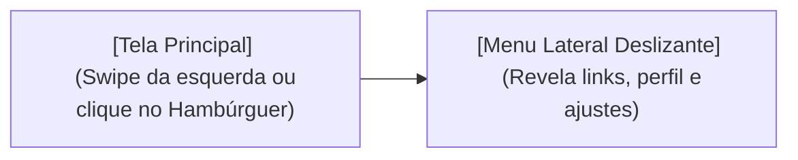

## Aula 12 — Navegação em Gaveta (Drawer Navigation)

## <i className="fa-solid fa-bullseye" style={{ color: 'var(--ifm-color-primary)' }}></i> Objetivo da aula

Compreender o conceito de menu lateral deslizante (*hamburger menu*) em ambientes mobile e aprender a instalar, configurar e customizar a navegação em gaveta (**Drawer Navigation**) utilizando o React Navigation para estruturar fluxos complexos e administrativos.

## <i className="fa-solid fa-book" style={{ color: 'var(--ifm-color-primary)' }}></i> Conteúdos trabalhados

- O conceito e ergonomia da navegação lateral deslizante (Drawer).
- Instalação do Drawer e de suas dependências essenciais: **Gesture Handler** e **Reanimated**.
- Configurando o roteador de gaveta **`createDrawerNavigator`**.
- Acionamento manual por código: **`openDrawer`**, **`closeDrawer`** e **`toggleDrawer`**.
- Criação de um menu lateral personalizado com cabeçalho de usuário.

## <i className="fa-solid fa-brain" style={{ color: 'var(--ifm-color-primary)' }}></i> Explicação

O **Drawer Navigation** (ou Navegação em Gaveta) é a barra lateral que fica oculta no lado esquerdo da tela do celular e desliza para o centro quando o usuário arrasta o dedo da borda da tela para o meio ou quando clica no famoso ícone de menu de três linhas (hambúrguer).

### Quando Usar o Drawer?
*   **Abas (Bottom Tabs)** são perfeitas para as **3 a 5 telas principais** do aplicativo, onde o usuário precisa trocar constantemente com um clique do polegar.
*   **Gavetas (Drawer)** são perfeitas para **telas secundárias, painéis administrativos ou links de suporte** que não devem poluir o menu inferior principal. Exemplos clássicos: Gmail (Pastas de entrada, spam, lixeira), Slack (canais), Google Drive.



---

### Instalação Passo a Passo (Garantindo que não trave)

O Drawer exige mais bibliotecas de suporte nativo, pois lida com arrastos físicos (*gestures*) e animações de alta performance (*reanimated*).

#### 1. Instalar o pacote do Drawer:
```bash
npm install @react-navigation/drawer
```

#### 2. Instalar as dependências de toque e animação oficiais do Expo:
```bash
npx expo install react-native-gesture-handler react-native-reanimated
```

> [!IMPORTANT]
> **A Regra de Ouro do Drawer:** Você **DEVE** adicionar a linha `import 'react-native-gesture-handler';` no **topo absoluto** (na linha 1!) do seu arquivo `App.js`. Se você esquecer essa importação, o motor de gestos do celular não inicializará e o app dará tela preta/vermelha imediatamente.

---

### Controlando a Gaveta via Código
Além de arrastar a tela, você pode forçar a abertura da gaveta programaticamente usando o objeto `navigation` que é injetado nas telas:
*   Abrir gaveta: `navigation.openDrawer();`
*   Fechar gaveta: `navigation.closeDrawer();`
*   Alternar estado (se fechado abre, se aberto fecha): `navigation.toggleDrawer();`

## <i className="fa-solid fa-laptop-code" style={{ color: 'var(--ifm-color-primary)' }}></i> Exemplo prático

Substitua todo o conteúdo do seu `App.js` por este aplicativo estilo **Gmail Clássico**. Ele contém uma gaveta lateral personalizada com fotos e e-mails de exemplo e navega de forma ultra-suave usando gestos e cliques:

```javascript
// ATENÇÃO: Importação obrigatória na linha 1 para o Drawer funcionar!
import 'react-native-gesture-handler';

import React from 'react';
import { View, Text, StyleSheet, FlatList, TouchableOpacity } from 'react-native';
import { NavigationContainer } from '@react-navigation/native';
import { createDrawerNavigator, DrawerContentScrollView, DrawerItemList } from '@react-navigation/drawer';

// ==========================================
// TELA 1 - CAIXA DE ENTRADA (INBOX)
// ==========================================
function TelaCaixaEntrada({ navigation }) {
  const emails = [
    { id: '1', remetente: 'Google Deepmind', assunto: 'Seu assistente Antigravity está pronto!', hora: '08:30' },
    { id: '2', remetente: 'Figma Team', assunto: 'Novos recursos de animação interativa lançados.', hora: 'Ontem' },
    { id: '3', remetente: 'GitHub Notify', assunto: 'Seu Pull Request foi mesclado com sucesso.', hora: '15 mai' },
  ];

  return (
    <View style={estilos.telaGeral}>
      {/* Botão flutuante para abrir o menu caso queira simular sem swipe */}
      <TouchableOpacity 
        style={estilos.botaoMenuFlutuante}
        onPress={() => navigation.toggleDrawer()}
      >
        <Text style={estilos.textoBotaoMenu}>☰ Abrir Menu Lateral</Text>
      </TouchableOpacity>

      <Text style={estilos.tituloCaixa}>Principal</Text>
      
      <FlatList 
        data={emails}
        keyExtractor={item => item.id}
        renderItem={({ item }) => (
          <View style={estilos.cardEmail}>
            <View style={estilos.avatarSimulado}>
              <Text style={estilos.letraAvatar}>{item.remetente.charAt(0)}</Text>
            </View>
            <View style={{ flex: 1 }}>
              <View style={estilos.linhaEmail}>
                <Text style={estilos.remetente}>{item.remetente}</Text>
                <Text style={estilos.hora}>{item.hora}</Text>
              </View>
              <Text style={estilos.assunto}>{item.assunto}</Text>
            </View>
          </View>
        )}
        ItemSeparatorComponent={() => <View style={estilos.divisor} />}
      />
    </View>
  );
}

// ==========================================
// TELA 2 - ENVIADOS (SENT)
// ==========================================
function TelaEnviados() {
  return (
    <View style={estilos.telaGeralCentrada}>
      <Text style={estilos.textoCentral}>Caixa de Itens Enviados 📤</Text>
      <Text style={estilos.subtextoCentral}>Nenhum e-mail enviado recentemente.</Text>
    </View>
  );
}

// ==========================================
// TELA 3 - CONFIGURAÇÕES (SETTINGS)
// ==========================================
function TelaConfiguracoes() {
  return (
    <View style={estilos.telaGeralCentrada}>
      <Text style={estilos.textoCentral}>Ajustes do Aplicativo ⚙️</Text>
      <Text style={estilos.subtextoCentral}>Gerencie temas, assinaturas e alertas de som.</Text>
    </View>
  );
}

// ==========================================
// GAVETA LATERAL CUSTOMIZADA (CABEÇALHO)
// ==========================================
function ConteudoCustomizadoDrawer(props) {
  return (
    <DrawerContentScrollView {...props} style={{ backgroundColor: '#1E293B' }}>
      {/* Cabeçalho Personalizado do Usuário */}
      <View style={estilos.cabecalhoDrawer}>
        <View style={estilos.fotoPerfil}>
          <Text style={estilos.letraPerfil}>D</Text>
        </View>
        <Text style={estilos.nomeUsuario}>Dev Mobile Jr</Text>
        <Text style={estilos.emailUsuario}>desenvolvedor@escola.com</Text>
      </View>

      {/* Renderiza a lista padrão de telas registradas */}
      <DrawerItemList {...props} />
    </DrawerContentScrollView>
  );
}

// ==========================================
// CONFIGURAÇÃO DO ROTEADOR
// ==========================================
const Drawer = createDrawerNavigator();

export default function App() {
  return (
    <NavigationContainer>
      <Drawer.Navigator
        // Injetamos nosso componente customizado com foto de perfil no topo da gaveta
        drawerContent={(props) => <ConteudoCustomizadoDrawer {...props} />}
        screenOptions={{
          headerStyle: { backgroundColor: '#1E293B', borderBottomWidth: 0 },
          headerTintColor: '#FFFFFF',
          headerTitleAlign: 'center',
          drawerActiveTintColor: '#EF4444', // Cor vermelha do menu selecionado
          drawerInactiveTintColor: '#94A3B8', // Cor cinza do menu inativo
          drawerStyle: { width: 280 },
        }}
      >
        <Drawer.Screen 
          name="CaixaEntrada" 
          component={TelaCaixaEntrada} 
          options={{ 
            title: 'Caixa de Entrada',
            drawerIcon: () => <Text style={{ fontSize: 18 }}>📥</Text>
          }} 
        />
        <Drawer.Screen 
          name="Enviados" 
          component={TelaEnviados} 
          options={{ 
            title: 'Enviados',
            drawerIcon: () => <Text style={{ fontSize: 18 }}>📤</Text>
          }} 
        />
        <Drawer.Screen 
          name="Configuracoes" 
          component={TelaConfiguracoes} 
          options={{ 
            title: 'Ajustes',
            drawerIcon: () => <Text style={{ fontSize: 18 }}>⚙️</Text>
          }} 
        />
      </Drawer.Navigator>
    </NavigationContainer>
  );
}

// ==========================================
// ESTILOS
// ==========================================
const estilos = StyleSheet.create({
  telaGeral: {
    flex: 1,
    backgroundColor: '#0F172A',
    padding: 20,
  },
  telaGeralCentrada: {
    flex: 1,
    backgroundColor: '#0F172A',
    justifyContent: 'center',
    alignItems: 'center',
  },
  botaoMenuFlutuante: {
    backgroundColor: '#1E293B',
    borderColor: '#334155',
    borderWidth: 1,
    padding: 12,
    borderRadius: 8,
    alignItems: 'center',
    marginBottom: 20,
  },
  textoBotaoMenu: {
    color: '#F8FAFC',
    fontWeight: 'bold',
  },
  tituloCaixa: {
    color: '#94A3B8',
    fontSize: 12,
    fontWeight: 'bold',
    textTransform: 'uppercase',
    letterSpacing: 1,
    marginBottom: 16,
  },
  cardEmail: {
    flexDirection: 'row',
    alignItems: 'center',
    paddingVertical: 14,
  },
  avatarSimulado: {
    width: 40,
    height: 40,
    borderRadius: 20,
    backgroundColor: '#EF4444',
    justifyContent: 'center',
    alignItems: 'center',
    marginRight: 16,
  },
  letraAvatar: {
    color: '#FFFFFF',
    fontWeight: 'bold',
    fontSize: 16,
  },
  linhaEmail: {
    flexDirection: 'row',
    justifyContent: 'space-between',
    marginBottom: 4,
  },
  remetente: {
    color: '#F8FAFC',
    fontSize: 15,
    fontWeight: 'bold',
  },
  hora: {
    color: '#64748B',
    fontSize: 12,
  },
  assunto: {
    color: '#94A3B8',
    fontSize: 13,
  },
  divisor: {
    height: 1,
    backgroundColor: '#1E293B',
  },
  textoCentral: {
    color: '#F8FAFC',
    fontSize: 18,
    fontWeight: 'bold',
    marginBottom: 8,
  },
  subtextoCentral: {
    color: '#64748B',
    fontSize: 14,
  },
  cabecalhoDrawer: {
    padding: 24,
    borderBottomWidth: 1,
    borderBottomColor: '#334155',
    marginBottom: 16,
  },
  fotoPerfil: {
    width: 60,
    height: 60,
    borderRadius: 30,
    backgroundColor: '#3B82F6',
    justifyContent: 'center',
    alignItems: 'center',
    marginBottom: 12,
  },
  letraPerfil: {
    color: '#FFFFFF',
    fontSize: 24,
    fontWeight: 'bold',
  },
  nomeUsuario: {
    color: '#F8FAFC',
    fontSize: 16,
    fontWeight: 'bold',
  },
  emailUsuario: {
    color: '#94A3B8',
    fontSize: 13,
  },
});
```

## <i className="fa-solid fa-flask" style={{ color: 'var(--ifm-color-primary)' }}></i> Atividade prática

Abra o seu aplicativo `meu-primeiro-app` no VS Code. Vamos criar a estrutura de um **Painel de Controle Corporativo (Admin Dashboard)**:
1. Instale o pacote do Drawer e as dependências nativas (`gesture-handler` e `reanimated`).
2. Adicione obrigatoriamente a linha de import de toque na linha 1 do `App.js`.
3. Configure **três telas de roteamento na gaveta**:
   - **`Dashboard` (Painel)**: Exiba uma lista de indicadores e estatísticas da empresa (ex: Faturamento R$ 45.000, Clientes Ativos 150) com cores sofisticadas.
   - **`Clientes` (Customer Management)**: Exiba uma FlatList com alguns clientes e telefones.
   - **`Suporte` (Help Desk)**: Exiba um formulário simples de contato (TextInput para mensagem e botão "Enviar Chamado").
4. Crie uma **Gaveta Personalizada** (`ConteudoCustomizadoDrawer`) contendo a foto e o e-mail de administrador da empresa no topo e passe-a na propriedade `drawerContent`.
5. Estilize a cor ativa e os ícones com Emojis condizentes (Dashboard: 📊, Clientes: 👥, Suporte: ⚙️).

## <i className="fa-solid fa-list-check" style={{ color: 'var(--ifm-color-primary)' }}></i> Checklist de entrega

- [ ] A importação `'react-native-gesture-handler';` está colocada na linha 1 do arquivo `App.js`.
- [ ] O roteador `createDrawerNavigator` e todas as dependências nativas foram instalados com sucesso no terminal.
- [ ] O menu lateral (gaveta) abre perfeitamente através de gestos de arraste e do clique no botão hambúrguer.
- [ ] A gaveta exibe o cabeçalho personalizado com e-mail do admin no topo do menu lateral.
- [ ] As 3 telas (Dashboard, Clientes, Suporte) alternam seu estado e carregam seus conteúdos de forma responsiva.

## <i className="fa-solid fa-rocket" style={{ color: 'var(--ifm-color-primary)' }}></i> Agora é com você!

Domine a experiência visual e os fluxos do Drawer:
- **Combinando Tabs com Drawer:** Você sabia que o menu mais profissional do mercado consiste em usar Bottom Tabs e colocar uma das abas para abrir o Drawer? Faça com que uma aba inferior chamada "Mais opções" ative a abertura da gaveta lateral usando `navigation.openDrawer()`.
- **Desabilitando Gestos nas Telas:** Por motivos de segurança, você pode querer que o menu lateral só abra quando o usuário clicar no botão superior e proibir o gesto de arraste com o polegar. Adicione a propriedade **`swipeEnabled: false`** nas opções da tela e teste o arraste lateral.
- **Customizando o Design dos Itens:** Altere as bordas e os cantos arredondados das opções da barra lateral editando as propriedades do `drawerContentOptions` para deixar os botões com visual de pílulas flutuantes.

