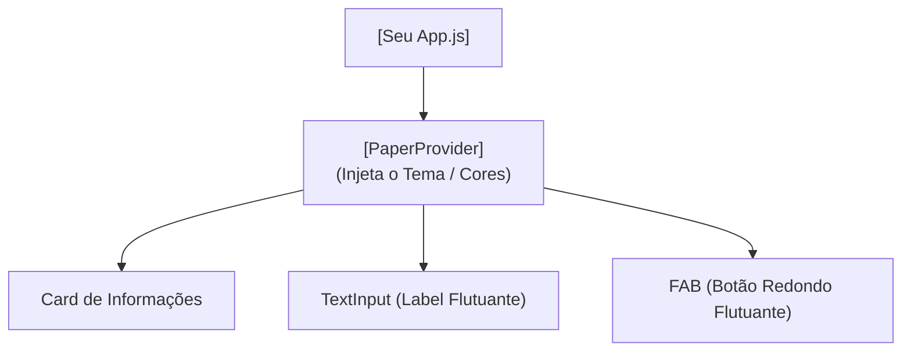

## Aula 13 — Bibliotecas de Componentes Visuais

## <i className="fa-solid fa-bullseye" style={{ color: 'var(--ifm-color-primary)' }}></i> Objetivo da aula

Compreender a importância das bibliotecas de componentes de interface (UI Libraries) no desenvolvimento móvel ágil e aprender a instalar, configurar e integrar a biblioteca **React Native Paper** para acelerar a criação de telas modernas utilizando elementos pré-estilizados baseados no Material Design da Google.

## <i className="fa-solid fa-book" style={{ color: 'var(--ifm-color-primary)' }}></i> Conteúdos trabalhados

- O conceito de bibliotecas de componentes prontos (UI/UX) vs. estilos customizados.
- Instalação e configuração completa do **React Native Paper** no ecossistema Expo.
- O wrapper de injeção global **`PaperProvider`**.
- Utilização de componentes pré-estilizados: **`Button`**, **`Card`**, **`TextInput` (com labels flutuantes)**, **`Avatar`** e **`FAB` (Floating Action Button)**.
- Personalização básica de temas (Themes).

## <i className="fa-solid fa-brain" style={{ color: 'var(--ifm-color-primary)' }}></i> Explicação

Até o momento, nós estilizamos cada margem, borda, cor de fundo e sombra dos nossos botões e inputs manualmente usando `StyleSheet.create`. 

Embora esse método seja fundamental para aprender as regras básicas do CSS no mobile, no mercado de trabalho real, os desenvolvedores utilizam **Bibliotecas de Componentes de UI (Interface do Usuário)** para acelerar o desenvolvimento.

### Por que Usar uma Biblioteca de Componentes?
*   **Velocidade:** Você não precisa programar botões ou sombras do zero. O componente já está pronto para uso.
*   **Consistência Visual:** Todas as telas ganham a mesma identidade visual e as mesmas cores de forma harmoniosa automaticamente.
*   **Acessibilidade e Usabilidade:** Os componentes já possuem animações nativas modernas e foram testados contra falhas de tamanho e toque em centenas de tamanhos de celulares diferentes.

### Conhecendo o React Native Paper
O **React Native Paper** é uma das bibliotecas de componentes mais famosas e consolidadas para React Native. Ela implementa as regras visuais do **Material Design** (o sistema de design oficial criado pela Google para o sistema Android).



---

### Instalação no Expo

Para instalar o React Native Paper no seu aplicativo, basta executar este comando no terminal do VS Code:

```bash
npm install react-native-paper react-native-safe-area-context
```

*Por rodar perfeitamente no ambiente Expo, nenhuma configuração extra nativa de pastas é necessária!*

---

### O Wrapper Principal: PaperProvider
Para que o sistema de temas, ícones e alertas da biblioteca funcione corretamente, você deve envelopar o aplicativo inteiro dentro do componente **`PaperProvider`** (geralmente no retorno principal do `App.js`):

```javascript
import { Provider as PaperProvider } from 'react-native-paper';

export default function App() {
  return (
    <PaperProvider>
      {/* Todo o seu aplicativo vive aqui dentro */}
    </PaperProvider>
  );
}
```

## <i className="fa-solid fa-laptop-code" style={{ color: 'var(--ifm-color-primary)' }}></i> Exemplo prático

Substitua todo o conteúdo do seu `App.js` por este **Gerenciador de Chamados de Suporte (Help Desk)**. Note que quase não usamos estilos manuais de CSS! A biblioteca desenha de forma instantânea os inputs com efeito de escrita (o texto flutua para o topo), o botão redondo flutuante no canto e os avatares com letras:

```javascript
import React, { useState } from 'react';
import { View, StyleSheet, FlatList, Alert } from 'react-native';
import { 
  Provider as PaperProvider, 
  MD3DarkTheme, 
  Text, 
  Card, 
  Button, 
  Avatar, 
  TextInput, 
  FAB 
} from 'react-native-paper';

// Customizamos o tema padrão escuro para um azul escuro sofisticado
const meuTema = {
  ...MD3DarkTheme,
  colors: {
    ...MD3DarkTheme.colors,
    primary: '#3B82F6', // Azul brilhante
    secondary: '#10B981', // Verde
    background: '#0F172A', // Slate escuro
    surface: '#1E293B', // Slate mais claro para os cards
  },
};

export default function App() {
  const [chamados, setChamados] = useState([
    { id: '1', titulo: 'Erro no login com Apple ID', prioridade: 'Alta', solicitante: 'Carlos Souza' },
    { id: '2', titulo: 'Ajuste de margens na home screen', prioridade: 'Baixa', solicitante: 'Ana Silva' },
  ]);

  const [novoChamado, setNovoChamado] = useState('');
  const [solicitante, setSolicitante] = useState('');

  const criarChamado = () => {
    if (!novoChamado.trim() || !solicitante.trim()) {
      Alert.alert('Aviso', 'Preencha o título e o seu nome antes de cadastrar!');
      return;
    }

    const item = {
      id: Date.now().toString(),
      titulo: novoChamado,
      prioridade: 'Média',
      solicitante: solicitante
    };

    setChamados([item, ...chamados]);
    setNovoChamado('');
    setSolicitante('');
    Alert.alert('Sucesso', 'Chamado de suporte aberto com sucesso!');
  };

  return (
    <PaperProvider theme={meuTema}>
      <View style={estilos.telaGeral}>
        
        {/* CABEÇALHO */}
        <Text variant="headlineMedium" style={estilos.titulo}>
          Ticket Force ⚡
        </Text>
        <Text variant="bodyMedium" style={estilos.subtitulo}>
          Painel ágil de controle de chamados técnicos
        </Text>

        {/* INPUTS ESTILIZADOS COM VALIDAÇÃO E FLUTUAÇÃO DE TEXTO */}
        <View style={estilos.areaInputs}>
          <TextInput
            label="Título da ocorrência..."
            mode="outlined"
            value={novoChamado}
            onChangeText={setNovoChamado}
            style={estilos.input}
          />
          <TextInput
            label="Seu Nome (Solicitante)..."
            mode="outlined"
            value={solicitante}
            onChangeText={setSolicitante}
            style={estilos.input}
          />
          <Button 
            mode="contained" 
            onPress={criarChamado}
            style={estilos.botao}
          >
            Abrir Chamado
          </Button>
        </View>

        {/* LISTAGEM DE CARDS PRONTOS */}
        <Text variant="titleMedium" style={estilos.secaoTitulo}>
          Chamados em Aberto
        </Text>

        <FlatList 
          data={chamados}
          keyExtractor={item => item.id}
          contentContainerStyle={{ paddingBottom: 100 }}
          renderItem={({ item }) => (
            <Card style={estilos.card} mode="elevated">
              <Card.Title
                title={item.titulo}
                subtitle={`Solicitado por: ${item.solicitante}`}
                // Injeta um Avatar circular com a letra inicial do remetente
                left={(props) => (
                  <Avatar.Text 
                    {...props} 
                    size={40} 
                    label={item.solicitante.charAt(0)} 
                    backgroundColor="#3B82F6"
                  />
                )}
              />
              <Card.Content>
                <Text variant="bodySmall" style={{ color: '#94A3B8' }}>
                  Prioridade do chamado: {item.prioridade}
                </Text>
              </Card.Content>
              <Card.Actions>
                <Button 
                  textColor="#EF4444" 
                  onPress={() => setChamados(chamados.filter(c => c.id !== item.id))}
                >
                  Resolver
                </Button>
              </Card.Actions>
            </Card>
          )}
          ItemSeparatorComponent={() => <View style={{ height: 12 }} />}
        />

        {/* BOTÃO FLUTUANTE (FAB) REDONDO */}
        <FAB
          icon="plus"
          style={estilos.fab}
          onPress={() => Alert.alert('Dica', 'Use o formulário acima para abrir ocorrências de forma direta!')}
          color="#FFFFFF"
        />

      </View>
    </PaperProvider>
  );
}

const estilos = StyleSheet.create({
  telaGeral: {
    flex: 1,
    backgroundColor: '#0F172A',
    paddingTop: 60,
    paddingHorizontal: 20,
  },
  titulo: {
    color: '#F8FAFC',
    fontWeight: 'bold',
  },
  subtitulo: {
    color: '#94A3B8',
    marginBottom: 24,
  },
  areaInputs: {
    backgroundColor: '#1E293B',
    padding: 16,
    borderRadius: 16,
    borderWidth: 1,
    borderColor: '#334155',
    gap: 12,
    marginBottom: 28,
  },
  input: {
    backgroundColor: '#1E293B',
  },
  botao: {
    marginTop: 8,
    borderRadius: 8,
  },
  secaoTitulo: {
    color: '#F8FAFC',
    fontWeight: 'bold',
    marginBottom: 16,
  },
  card: {
    backgroundColor: '#1E293B',
    borderWidth: 1,
    borderColor: '#334155',
  },
  fab: {
    position: 'absolute',
    margin: 16,
    right: 8,
    bottom: 8,
    backgroundColor: '#3B82F6',
    borderRadius: 28,
  },
});
```

## <i className="fa-solid fa-flask" style={{ color: 'var(--ifm-color-primary)' }}></i> Atividade prática

Abra o seu aplicativo `meu-primeiro-app` no VS Code. Vamos criar uma **Vitrine Virtual de Vendas (E-Commerce Showcase)** utilizando apenas componentes prontos do React Native Paper:
1. Instale a biblioteca `react-native-paper` e configure o `PaperProvider` no root do seu `App.js`.
2. Configure um tema dinâmico no Provider (escolha um tema claro ou escuro combinando as cores principais).
3. Na tela principal, exiba uma lista vertical de produtos (ex: "Computador Gamer", "Fone Ouvido Wireless", "Mouse Óptico") usando cards da biblioteca:
   - Use o componente **`Card`** para agrupar o produto.
   - Use **`Card.Cover`** para exibir uma foto do produto carregada a partir de uma URL da internet (ex: `https://picsum.photos/700` para gerar imagens aleatórias de alta definição).
   - Use **`Card.Title`** e **`Card.Content`** para exibir o título e preço.
   - Use **`Card.Actions`** com dois componentes **`Button`** da biblioteca: um botão estilo *outlined* escrito "Ver mais" e um botão preenchido (*contained*) escrito "Comprar".
4. Adicione um botão flutuante **`FAB`** no canto inferior direito com o ícone de carrinho ("cart") para simular a abertura do carrinho de compras!

## <i className="fa-solid fa-list-check" style={{ color: 'var(--ifm-color-primary)' }}></i> Checklist de entrega

- [ ] A biblioteca `react-native-paper` foi instalada com sucesso no terminal e importada no código.
- [ ] O aplicativo inteiro está envelopado no wrapper principal `PaperProvider` com um objeto de tema definido.
- [ ] Os produtos da vitrine são exibidos utilizando a estrutura padrão e limpa do componente `<Card>`.
- [ ] As imagens dos produtos carregam com sucesso através do `<Card.Cover>`.
- [ ] O botão redondo `<FAB>` flutua no canto inferior direito de forma fixa e exibe o ícone de compras.

## <i className="fa-solid fa-rocket" style={{ color: 'var(--ifm-color-primary)' }}></i> Agora é com você!

Descubra mais poderes do React Native Paper para deixar seu app profissional:
- **Alternador de Temas (Light / Dark Mode):** Crie um estado booleano `const [isEscuro, setIsEscuro] = useState(false)`. Coloque um componente Switch ou um botão no cabeçalho. Ao clicar, mude o estado e faça o `PaperProvider` receber alternadamente o `MD3DarkTheme` ou o `MD3LightTheme`! Isso criará o efeito de Dark Mode em tempo real!
- **Chips para Categorias:** Use o componente **`Chip`** do React Native Paper (aqueles pequenos botões ovalados com texto e ícone, ex: "Eletrônicos", "Moda") para criar uma barra de categorias horizontais acima dos produtos.
- **TextInput com Ícones Internos:** Descubra como inserir ícones dentro dos campos de texto (como um cadeado no campo de senha ou uma lupa na barra de pesquisa) passando as propriedades `right={<TextInput.Icon icon="eye" />}`.
