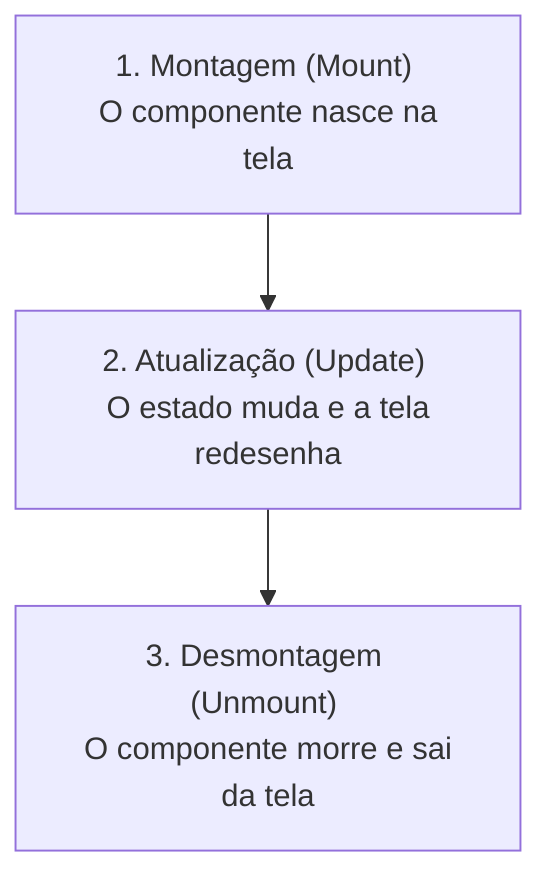

# Aula 16 — Efeitos Colaterais e Ciclo de Vida

## <i className="fa-solid fa-bullseye" style={{ color: 'var(--ifm-color-primary)' }}></i> Objetivo da aula

Compreender o ciclo de vida dos componentes React Native (montagem, atualização e desmontagem) e aprender a utilizar o hook **`useEffect`** para gerenciar efeitos colaterais de forma controlada e sem vazamentos de memória (*memory leaks*).

## <i className="fa-solid fa-book" style={{ color: 'var(--ifm-color-primary)' }}></i> Conteúdos trabalhados

- O conceito de "Ciclo de Vida" de uma tela de aplicativo (Mount, Update, Unmount).
- O que são efeitos colaterais (*side effects*) em ambientes mobile.
- A sintaxe e estrutura do hook **`useEffect`**.
- As três configurações do array de dependências:
  - Sem array de dependências (execução contínua).
  - Array de dependências vazio `[]` (execução única na montagem).
  - Array com variáveis `[estado]` (execução monitorada reativa).
- A função de limpeza (**cleanup**) para evitar vazamentos de memória.

## <i className="fa-solid fa-brain" style={{ color: 'var(--ifm-color-primary)' }}></i> Explicação

Até o momento, nossas telas eram simples e diretas: o usuário clicava em um botão, mudava um estado (`useState`) e a tela se redesenhava. No entanto, aplicativos reais realizam tarefas que saem do escopo visual básico do JSX: buscar dados de uma API, ler sensores de localização (GPS), inicializar temporizadores ou ler dados do banco de dados local.

Essas ações externas ao renderizador do React são chamadas de **Efeitos Colaterais (Side Effects)**. Para controlarmos em que momento exato esses efeitos acontecem no celular do usuário, recorremos ao ciclo de vida do componente.

### O Ciclo de Vida de um Componente Mobile

Um componente possui três momentos cruciais na memória do celular:



1.  **Montagem (Mounting):** O momento em que a tela acaba de aparecer na frente do usuário. Perfeito para buscar dados iniciais na internet.
2.  **Atualização (Updating):** Quando uma informação muda e a tela redesenha para se atualizar.
3.  **Desmontagem (Unmounting):** Quando o usuário sai dessa tela e ela é excluída da memória. Momento crítico para desligar alarmes, sensores e GPS, impedindo que o app continue consumindo bateria no plano de fundo.

---

### O Hook `useEffect`

O `useEffect` é o hook do React responsável por monitorar o ciclo de vida e executar nossos efeitos colaterais. A sua estrutura básica recebe uma função de efeito e um **array de dependências**:

```javascript
useEffect(() => {
  // Ação / Efeito colateral ocorre aqui...
}, [ dependencias ]);
```

Existem **três comportamentos diferentes** dependendo do preenchimento do array de dependências:

#### Caso A: Array Vazio `[]` (Executa apenas no nascimento/Mount)
Usado para buscar dados de APIs ou carregar dados salvos apenas uma vez ao abrir o app.
```javascript
useEffect(() => {
  console.log("A tela acaba de carregar na memória! 👶");
}, []);
```

#### Caso B: Sem Array (Comportamento Perigoso!)
Se você omitir o array, a função executará em **absolutamente toda renderização**. Se alterar um estado ali dentro, criará um loop infinito que travará o celular. Evite!
```javascript
useEffect(() => {
  console.log("Executa a cada milissegundo de redesenho da tela! ⚠️");
});
```

#### Caso C: Com Variáveis no Array `[estado]` (Monitorado/Update)
Executa na inicialização e **toda vez que o estado monitorado mudar**. Perfeito para atualizar cálculos automaticamente.
```javascript
useEffect(() => {
  console.log("O valor do contador mudou para: " + contador);
}, [contador]);
```

---

### A Função de Limpeza (Cleanup)
Quando iniciamos tarefas contínuas (como um timer rodando a cada segundo), precisamos desligá-las quando o componente sair da tela. Para fazer isso, basta **retornar uma função** dentro do `useEffect`. O React executará essa função de retorno logo na desmontagem (morte) do componente:

```javascript
useEffect(() => {
  const alarme = setInterval(() => console.log("Tic Tac..."), 1000);

  // Função de Limpeza (Cleanup)
  return () => {
    clearInterval(alarme); // Desliga o timer da memória! Previne leaks de bateria.
  };
}, []);
```

## <i className="fa-solid fa-laptop-code" style={{ color: 'var(--ifm-color-primary)' }}></i> Exemplo prático

Substitua todo o conteúdo do seu `App.js` por este **Cronômetro Avançado de Produtividade/Treinos**. Ele utiliza o `useEffect` para gerenciar um temporizador de alta performance na memória do celular, desligando-o perfeitamente caso o temporizador seja desativado para garantir a duração de bateria do aparelho:

```javascript
import React, { useState, useEffect } from 'react';
import { View, Text, StyleSheet, TouchableOpacity } from 'react-native';

export default function App() {
  const [segundos, setSegundos] = useState(0);
  const [ativo, setAtivo] = useState(false);

  // GERENCIADOR DE EFEITO DO CRONÔMETRO
  useEffect(() => {
    let intervalo = null;

    if (ativo) {
      // Se estiver ativo, inicia um temporizador nativo que roda a cada 1 segundo
      intervalo = setInterval(() => {
        setSegundos(s => s + 1);
      }, 1000);
    } else {
      // Se pausar, limpa o temporizador da memória
      clearInterval(intervalo);
    }

    // FUNÇÃO DE LIMPEZA (CLEANUP): Desliga o intervalo da memória se o app for recarregado
    return () => {
      clearInterval(intervalo);
    };
  }, [ativo]); // Fica vigiando o estado 'ativo' reativamente!

  // Formata os segundos em formato MM:SS
  const formatarTempo = (totalSegundos) => {
    const minutos = Math.floor(totalSegundos / 60);
    const segundosRestantes = totalSegundos % 60;
    
    const minFormatado = minutos < 10 ? `0${minutos}` : minutos;
    const segFormatado = segundosRestantes < 10 ? `0${segundosRestantes}` : segundosRestantes;
    
    return `${minFormatado}:${segFormatado}`;
  };

  return (
    <View style={estilos.telaGeral}>
      <Text style={estilos.cabecalho}>Focus Timer ⏱️</Text>
      <Text style={estilos.subcabecalho}>Aumente seu foco e produtividade</Text>

      {/* PAINEL CENTRAL DO RELÓGIO */}
      <View style={estilos.circuloTempo}>
        <Text style={estilos.timerTexto}>{formatarTempo(segundos)}</Text>
        <Text style={estilos.statusLegenda}>
          {ativo ? 'Focado e Trabalhando...' : 'Tempo Pausado'}
        </Text>
      </View>

      {/* CONTROLES */}
      <View style={estilos.botoesContainer}>
        
        <TouchableOpacity 
          style={[estilos.botao, ativo ? estilos.botaoPausa : estilos.botaoPlay]}
          onPress={() => setAtivo(!ativo)}
        >
          <Text style={estilos.textoBotao}>{ativo ? 'Pausar' : 'Iniciar Foco'}</Text>
        </TouchableOpacity>

        <TouchableOpacity 
          style={[estilos.botao, estilos.botaoReset]}
          onPress={() => {
            setAtivo(false);
            setSegundos(0);
          }}
        >
          <Text style={estilos.textoBotaoReset}>Zerar Tempo</Text>
        </TouchableOpacity>

      </View>
    </View>
  );
}

const estilos = StyleSheet.create({
  telaGeral: {
    flex: 1,
    backgroundColor: '#0F172A',
    justifyContent: 'center',
    alignItems: 'center',
    padding: 24,
  },
  cabecalho: {
    color: '#F8FAFC',
    fontSize: 28,
    fontWeight: 'bold',
    marginBottom: 4,
  },
  subcabecalho: {
    color: '#64748B',
    fontSize: 14,
    marginBottom: 40,
  },
  circuloTempo: {
    width: 250,
    height: 250,
    borderRadius: 125,
    borderWidth: 8,
    borderColor: '#3B82F6',
    backgroundColor: '#1E293B',
    justifyContent: 'center',
    alignItems: 'center',
    marginBottom: 48,
    shadowColor: '#3B82F6',
    shadowOffset: { width: 0, height: 10 },
    shadowOpacity: 0.3,
    shadowRadius: 20,
  },
  timerTexto: {
    color: '#F8FAFC',
    fontSize: 48,
    fontWeight: 'bold',
  },
  statusLegenda: {
    color: '#94A3B8',
    fontSize: 12,
    marginTop: 8,
    textTransform: 'uppercase',
    letterSpacing: 1,
  },
  botoesContainer: {
    width: '100%',
    gap: 12,
  },
  botao: {
    height: 52,
    borderRadius: 14,
    justifyContent: 'center',
    alignItems: 'center',
  },
  botaoPlay: {
    backgroundColor: '#10B981',
  },
  botaoPausa: {
    backgroundColor: '#EF4444',
  },
  botaoReset: {
    backgroundColor: 'transparent',
    borderWidth: 1,
    borderColor: '#334155',
  },
  textoBotao: {
    color: '#FFFFFF',
    fontSize: 16,
    fontWeight: 'bold',
  },
  textoBotaoReset: {
    color: '#94A3B8',
    fontSize: 15,
  },
});
```

## <i className="fa-solid fa-flask" style={{ color: 'var(--ifm-color-primary)' }}></i> Atividade prática

Abra o seu aplicativo `meu-primeiro-app` no VS Code. Vamos criar um **Simulador de Pedômetro / Rastreador de Passos (Walking App Simulator)**:
1. No seu `App.js`, configure dois estados: `passos` (iniciando em 0) e `caminhando` (um booleano iniciando em `false`).
2. Crie um **`useEffect`** que monitore o estado `caminhando`.
   - Se `caminhando` for verdadeiro, inicialize um intervalo com `setInterval` rodando a cada **800 milissegundos** que soma `+2` passos ao estado de `passos`.
   - Se for falso, garanta a limpeza do intervalo.
   - **Super Obrigatório:** Escreva a função de retorno (cleanup) para desmontar e limpar o temporizador da memória de forma segura.
3. Desenhe uma interface futurista escura:
   - Exiba o número total de passos com tamanho destacado.
   - Crie um botão chamativo para ligar/desligar a caminhada ("Começar Treino" em verde e "Parar Treino" em vermelho).
   - Exiba uma legenda condicional: se estiver treinando, mostre "Caminhando... 🏃", se estiver parado, mostre "Descansando... 🚶".

## <i className="fa-solid fa-list-check" style={{ color: 'var(--ifm-color-primary)' }}></i> Checklist de entrega

- [ ] O hook `useEffect` está declarado recebendo o array de dependências monitorando o estado do treino `caminhando`.
- [ ] O temporizador simula o acréscimo de passos de forma automática a cada ciclo temporal.
- [ ] A função de limpeza `return () => clearInterval(...)` foi declarada corretamente impedindo vazamento de memória.
- [ ] A interface atualiza os textos visuais do boneco correndo ou parado de forma instantânea.
- [ ] O botão de zerar passos funciona redefinindo todos os estados sem congelar o app.

## <i className="fa-solid fa-rocket" style={{ color: 'var(--ifm-color-primary)' }}></i> Agora é com você!

Vá além e explore os limites das dependências:
- **Cálculo Reativo de Calorias Queimadas:** Crie um estado `calorias`. Adicione um segundo **`useEffect`** que vigia especificamente o número de `passos` ( array de dependência: `[passos]` ). Toda vez que o contador de passos mudar de valor, multiplique a quantidade de passos por `0.04` (calorias gastas por passo) e atualize o painel em tempo real!
- **Relógio Digital Adicional:** Crie um pequeno relógio digital secundário no cabeçalho do aplicativo que exibe a hora atual do celular atualizada a cada segundo (`new Date().toLocaleTimeString()`). Você precisará de outro `useEffect` com array vazio `[]` rodando em paralelo para atualizar a hora de forma independente.

