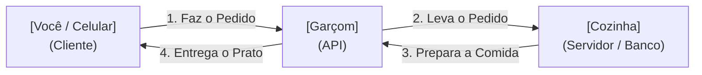

## Aula 17 — Introdução a APIs e JSON

## <i className="fa-solid fa-bullseye" style={{ color: 'var(--ifm-color-primary)' }}></i> Objetivo da aula

Compreender o conceito de APIs RESTful e o formato de dados JSON como a base para a comunicação de dados entre aplicativos móveis e servidores de banco de dados externos na nuvem.

## <i className="fa-solid fa-book" style={{ color: 'var(--ifm-color-primary)' }}></i> Conteúdos trabalhados

- O que é uma API (Application Programming Interface) e a arquitetura Cliente-Servidor.
- Os verbos e métodos de requisição HTTP principais: **GET**, **POST**, **PUT** e **DELETE**.
- A estrutura e sintaxe de formatação de dados do padrão **JSON**.
- O uso de utilitários de tratamento de texto em JavaScript: **`JSON.parse()`** e **`JSON.stringify()`**.
- O que é a API de simulação de testes pública **JSONPlaceholder**.

## <i className="fa-solid fa-brain" style={{ color: 'var(--ifm-color-primary)' }}></i> Explicação

Até o momento, todos os dados exibidos nos nossos aplicativos (como nossa lista de tarefas ou carteira financeira) foram salvos temporariamente na memória local do aparelho do usuário. Se o app fosse fechado ou desinstalado, esses dados desapareceriam.

Para salvar informações de forma permanente (como contas de usuários, compras ou mensagens de chat), o celular precisa se comunicar com um servidor central na nuvem onde live o banco de dados. Essa conversa é feita por meio de uma **API**.

---

### O que é uma API e a Analogia do Garçom

A sigla **API** (*Application Programming Interface* - Interface de Programação de Aplicação) funciona exatamente como o **garçom de um restaurante**:



1.  **O Cliente (Celular):** Olha o cardápio e faz o pedido (Ex: "Quero ver os últimos posts do Instagram").
2.  **O Garçom (API):** Pega o seu pedido e leva até a cozinha.
3.  **A Cozinha (Servidor/Banco de Dados):** Processa o pedido, busca as fotos no banco e as entrega para o garçom.
4.  **O Garçom (API):** Traz as fotos de volta e as exibe de forma organizada na sua tela.

---

### Os Verbos HTTP Principais
Para a API entender exatamente o que o aplicativo deseja fazer com os dados no servidor, nós utilizamos comandos chamados de **Métodos ou Verbos HTTP**:

*   **GET (Obter):** Solicita a leitura ou download de dados do servidor (Ex: Carregar sua timeline de fotos).
*   **POST (Criar):** Envia dados novos para serem inseridos e gravados no servidor (Ex: Cadastrar um novo perfil ou enviar uma mensagem).
*   **PUT (Atualizar):** Substitui e atualiza dados que já existem (Ex: Editar seu nome de perfil nas configurações).
*   **DELETE (Excluir):** Remove permanentemente um dado do servidor (Ex: Apagar uma postagem antiga).

---

### O Formato JSON (JavaScript Object Notation)
Quando o servidor responde com os dados solicitados pelo celular, os dados viajam pela internet formatados como uma string de texto estruturada sob as regras do **JSON**.

O JSON é baseado na sintaxe de objetos do JavaScript, com **duas regras estritas de formatação**:
1.  As propriedades (chaves) **devem** ser declaradas obrigatoriamente entre aspas duplas (`"nome"`).
2.  Strings de texto internas **devem** ser declaradas apenas com aspas duplas (`"Amanda Oliveira"`), nunca com aspas simples (`'`).

#### Comparação de Sintaxe:

*   **Objeto JS Comum (Código do seu app):**
    ```javascript
    const usuario = {
      nome: 'Amanda',
      idade: 21
    };
    ```

*   **Texto formatado em JSON (Texto enviado pela API):**
    ```json
    {
      "nome": "Amanda",
      "idade": 21
    }
    ```

#### Funções de Conversão em JavaScript:
Como as APIs enviam e recebem texto puro (String), precisamos converter esses formatos no nosso código:
*   **`JSON.parse(textoJSON)`**: Pega uma string de texto JSON e a transforma em um Objeto JavaScript real interativo.
*   **`JSON.stringify(objetoJS)`**: Pega um Objeto do seu código e o transforma em uma string de texto JSON pronta para ser enviada pela internet.

## <i className="fa-solid fa-laptop-code" style={{ color: 'var(--ifm-color-primary)' }}></i> Exemplo prático

Substitua todo o conteúdo do seu `App.js` por este **Leitor e Explorador Didático de JSON (JSON Parser & Viewer)**. Ele simula uma string de texto crua que acabou de chegar de uma API de estudantes e a decodifica de forma mágica, montando uma tela interativa de perfil com chips de habilidades em tempo real:

```javascript
import React, { useState, useEffect } from 'react';
import { View, Text, StyleSheet, FlatList, ActivityIndicator } from 'react-native';

// ==========================================
// STRING DE TEXTO JSON SIMULADA (Como chega da API)
// ==========================================
const stringJsonSimulado = `{
  "id": 847,
  "nome": "Amanda Oliveira",
  "curso": "Técnico em Desenvolvimento de Sistemas",
  "ativo": true,
  "habilidades": ["React Native", "JavaScript", "TypeScript", "CSS Mobile", "Figma Design"],
  "estatisticas": {
    "mediaGeral": 9.6,
    "faltas": 2,
    "projetosEntregues": 12
  }
}`;

export default function App() {
  const [objetoEstudante, setObjetoEstudante] = useState(null);
  const [carregando, setCarregando] = useState(true);

  useEffect(() => {
    // Simulando um pequeno delay de rede de 1.5 segundos para dar realismo de API
    const timer = setTimeout(() => {
      try {
        // CONVERTE A TEXTO BRUTO JSON EM UM OBJETO JS REAL INTERATIVO!
        const objetoDecodificado = JSON.parse(stringJsonSimulado);
        setObjetoEstudante(objetoDecodificado);
      } catch (erro) {
        console.error("Erro ao decodificar JSON:", erro);
      } finally {
        setCarregando(false);
      }
    }, 1500);

    return () => clearTimeout(timer);
  }, []);

  if (carregando) {
    return (
      <View style={estilos.telaGeralCentrada}>
        <ActivityIndicator size="large" color="#3B82F6" />
        <Text style={estilos.textoLoading}>Requisitando dados do estudante...</Text>
      </View>
    );
  }

  return (
    <View style={estilos.telaGeral}>
      <Text style={estilos.header}>JSON Parser Explorer 🔍</Text>
      <Text style={estilos.subHeader}>Decodificação de payloads em tempo real</Text>

      {/* CARD DO ESTUDANTE GERADO DE FORMA DINÂMICA PELO PARSER */}
      {objetoEstudante && (
        <View style={estilos.card}>
          <Text style={estilos.nomeEstudante}>{objetoEstudante.nome}</Text>
          <Text style={estilos.cursoEstudante}>{objetoEstudante.curso}</Text>

          {/* STATUS INTEGRADO */}
          <View style={[estilos.statusBadge, objetoEstudante.ativo ? estilos.badgeAtivo : estilos.badgeInativo]}>
            <Text style={estilos.textoStatus}>
              {objetoEstudante.ativo ? 'Matrícula Regular' : 'Matrícula Suspensa'}
            </Text>
          </View>

          <View style={estilos.divisor} />

          {/* ESTATÍSTICAS ANINHADAS */}
          <Text style={estilos.tituloSecao}>Métricas Acadêmicas</Text>
          <View style={estilos.linhaEstatisticas}>
            <View style={estilos.colunaStat}>
              <Text style={estilos.valorStat}>{objetoEstudante.estatisticas.mediaGeral}</Text>
              <Text style={estilos.legendaStat}>Média</Text>
            </View>
            <View style={estilos.colunaStat}>
              <Text style={estilos.valorStat}>{objetoEstudante.estatisticas.projetosEntregues}</Text>
              <Text style={estilos.legendaStat}>Entregas</Text>
            </View>
            <View style={estilos.colunaStat}>
              <Text style={estilos.valorStat}>{objetoEstudante.estatisticas.faltas}</Text>
              <Text style={estilos.legendaStat}>Faltas</Text>
            </View>
          </View>

          <View style={estilos.divisor} />

          {/* LISTA DE HABILIDADES */}
          <Text style={estilos.tituloSecao}>Habilidades Técnicas</Text>
          
          <FlatList
            data={objetoEstudante.habilidades}
            keyExtractor={item => item}
            horizontal
            showsHorizontalScrollIndicator={false}
            contentContainerStyle={estilos.containerHabilidades}
            renderItem={({ item }) => (
              <View style={estilos.chipHabilidade}>
                <Text style={estilos.textoChip}>⚡ {item}</Text>
              </View>
            )}
          />
        </View>
      )}
    </View>
  );
}

const estilos = StyleSheet.create({
  telaGeral: {
    flex: 1,
    backgroundColor: '#0F172A',
    paddingTop: 60,
    paddingHorizontal: 20,
  },
  telaGeralCentrada: {
    flex: 1,
    backgroundColor: '#0F172A',
    justifyContent: 'center',
    alignItems: 'center',
  },
  textoLoading: {
    color: '#94A3B8',
    marginTop: 16,
    fontSize: 14,
  },
  header: {
    color: '#F8FAFC',
    fontSize: 24,
    fontWeight: 'bold',
  },
  subHeader: {
    color: '#94A3B8',
    fontSize: 14,
    marginBottom: 32,
  },
  card: {
    backgroundColor: '#1E293B',
    borderRadius: 20,
    padding: 24,
    borderWidth: 1,
    borderColor: '#334155',
    shadowColor: '#000',
    shadowOffset: { width: 0, height: 8 },
    shadowOpacity: 0.3,
    shadowRadius: 15,
  },
  nomeEstudante: {
    color: '#F8FAFC',
    fontSize: 22,
    fontWeight: 'bold',
  },
  cursoEstudante: {
    color: '#3B82F6',
    fontSize: 14,
    marginTop: 4,
    marginBottom: 16,
  },
  statusBadge: {
    alignSelf: 'flex-start',
    paddingHorizontal: 12,
    paddingVertical: 5,
    borderRadius: 20,
    marginBottom: 20,
  },
  badgeAtivo: {
    backgroundColor: '#10B98120',
    borderWidth: 1,
    borderColor: '#10B981',
  },
  badgeInativo: {
    backgroundColor: '#EF444420',
    borderWidth: 1,
    borderColor: '#EF4444',
  },
  textoStatus: {
    color: '#F8FAFC',
    fontSize: 11,
    fontWeight: 'bold',
  },
  divisor: {
    height: 1,
    backgroundColor: '#334155',
    marginVertical: 18,
  },
  tituloSecao: {
    color: '#F8FAFC',
    fontSize: 14,
    fontWeight: 'bold',
    marginBottom: 16,
  },
  linhaEstatisticas: {
    flexDirection: 'row',
    justifyContent: 'space-around',
  },
  colunaStat: {
    alignItems: 'center',
  },
  valorStat: {
    color: '#F8FAFC',
    fontSize: 20,
    fontWeight: 'bold',
  },
  legendaStat: {
    color: '#64748B',
    fontSize: 12,
    marginTop: 4,
  },
  containerHabilidades: {
    gap: 8,
  },
  chipHabilidade: {
    backgroundColor: '#0F172A',
    borderColor: '#334155',
    borderWidth: 1,
    paddingHorizontal: 14,
    paddingVertical: 8,
    borderRadius: 30,
  },
  textoChip: {
    color: '#F8FAFC',
    fontSize: 12,
    fontWeight: 'bold',
  },
});
```

## <i className="fa-solid fa-flask" style={{ color: 'var(--ifm-color-primary)' }}></i> Atividade prática

Abra o seu aplicativo `meu-primeiro-app` no VS Code. Vamos criar um **Simulador de Vitrine de E-Commerce com JSON (E-Commerce Product JSON Explorer)**:
1. Declare em seu `App.js` uma constante contendo uma string JSON bruta representando as especificações de um eletrônico corporativo:
   ```javascript
   const jsonProdutoSimulado = `{
     "id": 101,
     "nome": "Monitor Gamer Curvo 27' UltraForce",
     "precoOriginal": 1499.90,
     "freteGratis": true,
     "especificacoes": {
       "resolucao": "2560x1440 (Quad HD)",
       "painelType": "VA Curvatura 1500R",
       "taxaAtualizacao": "165Hz"
     },
     "tags": ["Eletrônicos", "PC Gamer", "Monitores"]
   }`;
   ```
2. Carregue e decodifique a string usando `JSON.parse` dentro de um `useEffect` na inicialização do aplicativo.
3. Crie uma interface profissional no celular:
   - Exiba o Título do Monitor com destaque.
   - Exiba o preço formatado em Real (`R$ 1.499,90`).
   - Crie um selo dinâmico de frete: se `freteGratis` for verdadeiro, mostre um aviso em verde escrito "Frete Grátis para todo o Brasil 🚚".
   - Monte uma tabela ou lista exibindo as chaves e valores das `"especificacoes"` aninhadas de forma organizada.
   - Crie chips horizontais para exibir as tags associadas ao produto.

## <i className="fa-solid fa-list-check" style={{ color: 'var(--ifm-color-primary)' }}></i> Checklist de entrega

- [ ] A constante contendo a string de texto JSON foi definida seguindo as aspas duplas obrigatórias do padrão JSON.
- [ ] O aplicativo executa o método `JSON.parse()` na montagem da tela e armazena os dados decodificados em estado.
- [ ] O preço do produto e as tags são exibidos em formato de chips estilizados.
- [ ] As especificações aninhadas (resolução, painel, taxa) são exibidas de forma clara e legível.
- [ ] O aplicativo é compilado perfeitamente sem falhas de sintaxe JSON.

## <i className="fa-solid fa-rocket" style={{ color: 'var(--ifm-color-primary)' }}></i> Agora é com você!

Exercite a exportação de dados reversa no React Native:
- **Gerador de Payload JSON (Formulário Reverso):** Crie dois campos de entrada de texto (`TextInput`) no seu aplicativo: um para o "Nome do Novo Produto" e outro para o "Preço do Novo Produto". Crie um botão escrito "Exportar para JSON". Ao clicar, monte um objeto de dados e use o método **`JSON.stringify(objeto, null, 2)`** para convertê-lo de volta em texto bruto. Exiba esse texto bruto resultante na tela dentro de um bloco estilo terminal escuro! Isso ajudará a entender de forma inesquecível como o aplicativo envia dados para o servidor.

