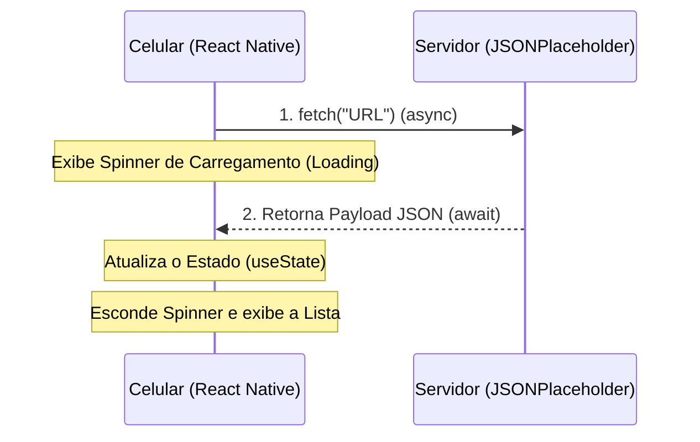

## Aula 18 — Consumindo API (Método GET) com Fetch

## <i className="fa-solid fa-bullseye" style={{ color: 'var(--ifm-color-primary)' }}></i> Objetivo da aula

Aprender a realizar requisições assíncronas do tipo **GET** utilizando a função nativa **`fetch`** do JavaScript com a sintaxe **`async/await`**, gerenciando estados de carregamento (*loading*), tratamento de erros e exibição de dados dinâmicos em componentes de listagem.

## <i className="fa-solid fa-book" style={{ color: 'var(--ifm-color-primary)' }}></i> Conteúdos trabalhados

- A natureza assíncrona da internet e o uso das declarações **`async`** e **`await`**.
- Efetuando chamadas de rede reais com a função nativa **`fetch()`**.
- Descodificando respostas HTTP com o método assíncrono **`.json()`**.
- Tratamento de estados fundamentais de integração: **Carregando** (Loading), **Erro** (try/catch) e **Sucesso**.
- Exibição de dados externos dinâmicos consumidos de APIs públicas com `<FlatList>`.

## <i className="fa-solid fa-brain" style={{ color: 'var(--ifm-color-primary)' }}></i> Explicação

Agora que compreendemos o que é uma API e como o JSON organiza as mensagens, chegou a hora de fazer o seu celular **conversar com um servidor real na internet**.

### A Importância do Desenvolvimento Assíncrono (`async/await`)
O processamento em celulares ocorre de forma ultra-rápida. No entanto, fazer o download de um arquivo de um servidor remoto que live em outro país pode demorar de centenas de milissegundos a vários segundos dependendo da qualidade do sinal do 4G/Wi-Fi do usuário.

Se programássemos essa busca de forma síncrona tradicional, **a interface do seu aplicativo congelaria por completo**, impossibilitando qualquer clique ou toque na tela até que o download terminasse. Isso geraria uma péssima experiência ao usuário.

Para evitar isso, criamos **Funções Assíncronas**:
*   **`async`**: Palavra-chave colocada antes da declaração da função para avisar ao JavaScript que ela rodará tarefas em plano de fundo sem bloquear a tela do celular.
*   **`await`**: Colocada antes de uma chamada de rede. Ela avisa: *"JavaScript, pause a execução desta linha específica até que o servidor responda, mas continue permitindo que o usuário clique e use a tela normalmente."*



---

### A Estrutura de Consumo com `fetch`
O React Native traz por padrão a função global **`fetch`**, que aceita a URL da API como argumento básico e retorna uma promessa de dados:

```javascript
async function carregarDados() {
  try {
    // 1. Faz a requisição HTTP GET na API
    const resposta = await fetch('https://jsonplaceholder.typicode.com/posts');
    
    // 2. Transforma o fluxo de texto bruto recebido em um Objeto JavaScript real
    const dados = await resposta.json();
    
    console.log(dados); // Pronto! Dados decodificados em mãos.
  } catch (erro) {
    console.log("Erro de internet ou servidor indisponível!", erro);
  }
}
```

---

### Os Três Estados Fundamentais de Integração
Para criar um aplicativo de alto nível, sua tela deve lidar visualmente com **três cenários**:
1.  **Carregando (Loading):** Mostra um indicador visual (como um círculo girando) avisando que o app está trabalhando na busca.
2.  **Sucesso (Data):** Ocorre quando os dados chegam com sucesso e preenchem nossa lista.
3.  **Erro (Error state):** Se o usuário estiver no Modo Avião ou se a internet cair, exiba uma mensagem amigável e um botão visível escrito "Tentar Novamente".

## <i className="fa-solid fa-laptop-code" style={{ color: 'var(--ifm-color-primary)' }}></i> Exemplo prático

Substitua todo o conteúdo do seu `App.js` por este **Leitor Global de Feed de Blog (Blog Feed Reader)**. Ele consome dados reais da API pública sandbox **JSONPlaceholder** e renderiza posts reais com gerenciamento suave de erros e estados de carregamento:

```javascript
import React, { useState, useEffect } from 'react';
import { 
  View, 
  Text, 
  StyleSheet, 
  FlatList, 
  ActivityIndicator, 
  TouchableOpacity 
} from 'react-native';

export default function App() {
  const [posts, setPosts] = useState([]);
  const [carregando, setCarregando] = useState(true);
  const [erro, setErro] = useState(false);

  // FUNÇÃO ASSÍNCRONA PARA BUSCAR OS DADOS NA API
  const buscarPosts = async () => {
    setCarregando(true);
    setErro(false);
    
    try {
      // Faz o GET na API de testes pública
      const resposta = await fetch('https://jsonplaceholder.typicode.com/posts');
      
      // Decodifica a resposta JSON em Array JavaScript
      const dados = await resposta.json();
      
      // Filtra apenas as primeiras 15 postagens para não lotar a tela
      setPosts(dados.slice(0, 15));
    } catch (erroDeRede) {
      console.error(erroDeRede);
      setErro(true); // Ativa o layout de erro caso a internet falhe
    } finally {
      setCarregando(false); // Desativa o círculo giratório de loading
    }
  };

  // Dispara a requisição automaticamente assim que o app é montado
  useEffect(() => {
    buscarPosts();
  }, []);

  // CENÁRIO A: TELA DE CARREGAMENTO (LOADING STATE)
  if (carregando) {
    return (
      <View style={estilos.telaGeralCentrada}>
        <ActivityIndicator size="large" color="#3B82F6" />
        <Text style={estilos.textoFeedback}>Buscando publicações recentes...</Text>
      </View>
    );
  }

  // CENÁRIO B: TELA DE ERRO DE CONEXÃO (ERROR STATE)
  if (erro) {
    return (
      <View style={estilos.telaGeralCentrada}>
        <Text style={estilos.textoEmojiErro}>📡❌</Text>
        <Text style={estilos.textoTituloErro}>Falha na Conexão</Text>
        <Text style={estilos.textoSubErro}>Não foi possível se comunicar com o servidor de banco de dados.</Text>
        
        <TouchableOpacity style={estilos.botaoRecarregar} onPress={buscarPosts}>
          <Text style={estilos.textoBotaoRecarregar}>Tentar Novamente</Text>
        </TouchableOpacity>
      </View>
    );
  }

  // CENÁRIO C: SUCESSO E EXIBIÇÃO DA LISTAGEM DINÂMICA
  return (
    <View style={estilos.telaGeral}>
      
      {/* CABEÇALHO */}
      <View style={estilos.cabecalhoContainer}>
        <Text style={estilos.header}>Global Feed 🌐</Text>
        <Text style={estilos.subHeader}>Publicações requisitadas via REST API</Text>
      </View>

      <FlatList
        data={posts}
        keyExtractor={item => item.id.toString()}
        contentContainerStyle={estilos.listaContainer}
        renderItem={({ item }) => (
          <View style={estilos.cardPost}>
            <View style={estilos.avatarPost}>
              <Text style={estilos.textoAvatar}>{item.id}</Text>
            </View>
            <View style={{ flex: 1 }}>
              <Text style={estilos.tituloPost}>{item.title}</Text>
              <Text style={estilos.corpoPost}>{item.body}</Text>
            </View>
          </View>
        )}
        ItemSeparatorComponent={() => <View style={estilos.divisor} />}
      />

    </View>
  );
}

const estilos = StyleSheet.create({
  telaGeral: {
    flex: 1,
    backgroundColor: '#0F172A',
  },
  telaGeralCentrada: {
    flex: 1,
    backgroundColor: '#0F172A',
    justifyContent: 'center',
    alignItems: 'center',
    padding: 24,
  },
  textoFeedback: {
    color: '#94A3B8',
    fontSize: 14,
    marginTop: 16,
  },
  textoEmojiErro: {
    fontSize: 48,
    marginBottom: 16,
  },
  textoTituloErro: {
    color: '#F8FAFC',
    fontSize: 20,
    fontWeight: 'bold',
    marginBottom: 8,
  },
  textoSubErro: {
    color: '#64748B',
    fontSize: 14,
    textAlign: 'center',
    lineHeight: 20,
    marginBottom: 24,
  },
  botaoRecarregar: {
    backgroundColor: '#3B82F6',
    paddingHorizontal: 24,
    paddingVertical: 14,
    borderRadius: 12,
  },
  textoBotaoRecarregar: {
    color: '#FFFFFF',
    fontWeight: 'bold',
    fontSize: 14,
  },
  cabecalhoContainer: {
    paddingTop: 60,
    paddingHorizontal: 20,
    paddingBottom: 20,
    backgroundColor: '#1E293B',
    borderBottomWidth: 1,
    borderBottomColor: '#334155',
  },
  header: {
    color: '#F8FAFC',
    fontSize: 24,
    fontWeight: 'bold',
  },
  subHeader: {
    color: '#94A3B8',
    fontSize: 13,
    marginTop: 2,
  },
  listaContainer: {
    padding: 20,
  },
  cardPost: {
    flexDirection: 'row',
    alignItems: 'flex-start',
    gap: 16,
    paddingVertical: 12,
  },
  avatarPost: {
    width: 36,
    height: 36,
    borderRadius: 18,
    backgroundColor: '#3B82F630',
    borderColor: '#3B82F650',
    borderWidth: 1,
    justifyContent: 'center',
    alignItems: 'center',
  },
  textoAvatar: {
    color: '#3B82F6',
    fontWeight: 'bold',
    fontSize: 12,
  },
  tituloPost: {
    color: '#F8FAFC',
    fontSize: 16,
    fontWeight: 'bold',
    textTransform: 'capitalize',
    marginBottom: 6,
  },
  corpoPost: {
    color: '#94A3B8',
    fontSize: 13,
    lineHeight: 18,
  },
  divisor: {
    height: 1,
    backgroundColor: '#1E293B',
    marginVertical: 16,
  },
});
```

## <i className="fa-solid fa-flask" style={{ color: 'var(--ifm-color-primary)' }}></i> Atividade prática

Abra o seu aplicativo `meu-primeiro-app` no VS Code. Vamos criar um **Catálogo de Colaboradores Corporativos (Staff Catalog)**:
1. No seu `App.js`, configure a lógica de requisição `fetch` assíncrona apontando para a URL pública:
   `https://jsonplaceholder.typicode.com/users`
2. Gerencie os estados de `carregando`, `erro` e armazene a lista de colaboradores em um estado de `colaboradores` (iniciando como array vazio `[]`).
3. Construa a listagem usando o `<FlatList>` do React Native:
   - Exiba um card sofisticado para cada colaborador.
   - Mostre um avatar circular exibindo a primeira letra do nome de cada um em cores vibrantes.
   - Mostre o Nome e o E-mail em destaque.
   - Acesse os objetos aninhados no JSON e exiba a Empresa (`item.company.name`) e a Cidade (`item.address.city`) em um subtexto organizado.
4. Adicione um botão "Recarregar Lista" fixado no cabeçalho do aplicativo para testar o re-disparo da função.

## <i className="fa-solid fa-list-check" style={{ color: 'var(--ifm-color-primary)' }}></i> Checklist de entrega

- [ ] A função assíncrona foi declarada com sucesso usando a sintaxe de controle `async` e `await`.
- [ ] O `fetch()` consome o endpoint oficial de usuários (`/users`) e decodifica as informações com `.json()`.
- [ ] A tela exibe o círculo de carregamento (`<ActivityIndicator>`) enquanto baixa os dados da rede.
- [ ] O tratamento de erros com `try/catch` está implementado e o botão de recarga força novas requisições.
- [ ] Os dados dinâmicos (Nome, Empresa, Cidade) são recuperados com sucesso do JSON dinâmico.

## <i className="fa-solid fa-rocket" style={{ color: 'var(--ifm-color-primary)' }}></i> Agora é com você!

Adicione interações nativas sofisticadas e de nível sênior:
- **Habilitando Pull to Refresh (Puxar para Recarregar):** O React Native possui suporte nativo à ação física de puxar a lista para recarregar! Descubra como é fácil: adicione na sua `<FlatList>` as propriedades **`refreshing={carregando}`** e **`onRefresh={buscarPosts}`**. Teste arrastando a lista de colaboradores para baixo no simulador e veja a animação giratória do sistema operacional aparecer de forma nativa!
- **Pesquisa Local de Colaboradores:** Crie uma barra de busca (`TextInput`) no topo da lista. Crie um estado `pesquisa` e filtre a lista de colaboradores dinamicamente usando o método `.filter()` do JavaScript para que, à medida que o aluno digite o nome do funcionário, a lista seja filtrada instantaneamente sem fazer novas chamadas de rede.

