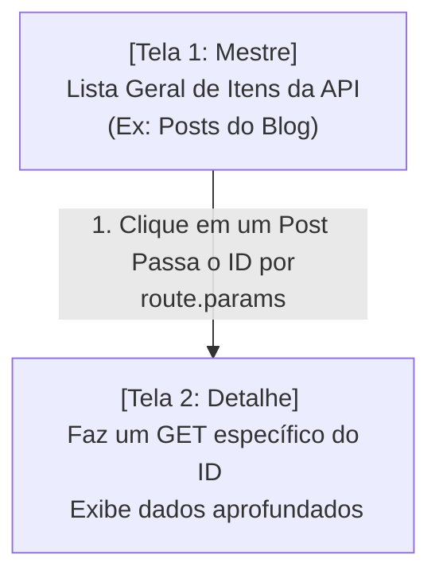

## Aula 19 — Prática Integrada (API + Navegação)

## <i className="fa-solid fa-bullseye" style={{ color: 'var(--ifm-color-primary)' }}></i> Objetivo da aula

Consolidar de forma prática a união dos dois maiores pilares do desenvolvimento mobile: **Navegação Dinâmica por Empilhamento (Stack Navigation)** e **Consumo Assíncrono de APIs Externas**, projetando um fluxo completo de listagem e detalhes do início ao fim.

## <i className="fa-solid fa-book" style={{ color: 'var(--ifm-color-primary)' }}></i> Conteúdos trabalhados

- Integração total de conceitos de engenharia: Roteamento + Chamadas de Rede + UI/UX Customizada.
- Navegação entre telas passando parâmetros dinâmicos identificadores (`route.params`).
- Requisições assíncronas sob demanda filtradas por ID no nascimento da tela.
- Gerenciamento unificado de erros de rede e carregamento (*loading placeholders*).
- Formatação e exibição de dados complexos e aninhados.

## <i className="fa-solid fa-brain" style={{ color: 'var(--ifm-color-primary)' }}></i> Explicação

Até aqui, aprendemos de forma isolada a criar menus deslizantes, navegar entre telas estáticas, ler arquivos JSON e baixar dados gerais da internet. Mas no mundo profissional real, os conceitos vivem de forma **100% integrada**.

A arquitetura mais comum de aplicativos comerciais (como YouTube, NetFlix, iFood e WhatsApp) é o padrão **Master-Detail (Mestre-Detalhe)**:



1.  **Tela Mestre (Lista Geral):** O aplicativo realiza uma chamada de rede geral na API, baixa uma lista de itens resumidos e a renderiza em uma `FlatList`. Cada item da lista é um botão de clique.
2.  **Transição com Parâmetros:** Ao tocar em um item, a navegação é disparada levando apenas o **ID único** daquele item para a próxima tela.
3.  **Tela de Detalhe:** Ao abrir, a tela de detalhes pega o ID recebido e faz uma **nova requisição HTTP específica** no servidor (Ex: `https://api.com/usuarios/ID`). Ela aguarda o download de dados aprofundados e exibe um painel completo para o usuário.

## <i className="fa-solid fa-laptop-code" style={{ color: 'var(--ifm-color-primary)' }}></i> Exemplo prático

Substitua todo o conteúdo do seu `App.js` por este **Catálogo Corporativo de Equipes (Dev Directory)**. Ele possui integração com a API JSONPlaceholder. 
A tela inicial exibe os desenvolvedores da equipe. Ao clicar em qualquer profissional, o aplicativo abre uma transição de empilhamento suave (Stack), recupera o ID do desenvolvedor, faz um carregamento focado na API e exibe suas informações completas (telefone, endereço, site e empresa) com visual elegante em Dark Mode:

```javascript
import React, { useState, useEffect } from 'react';
import { 
  View, 
  Text, 
  StyleSheet, 
  FlatList, 
  ActivityIndicator, 
  TouchableOpacity 
} from 'react-native';
import { NavigationContainer } from '@react-navigation/native';
import { createStackNavigator } from '@react-navigation/stack';

// ==========================================
// TELA 1: LISTA GERAL DE DESENVOLVEDORES (MASTER)
// ==========================================
function TelaLista({ navigation }) {
  const [desenvolvedores, setDesenvolvedores] = useState([]);
  const [carregando, setCarregando] = useState(true);

  useEffect(() => {
    const buscarDevs = async () => {
      try {
        const resposta = await fetch('https://jsonplaceholder.typicode.com/users');
        const dados = await resposta.json();
        setDesenvolvedores(dados);
      } catch (erro) {
        console.error("Falha ao carregar devs", erro);
      } finally {
        setCarregando(false);
      }
    };
    buscarDevs();
  }, []);

  if (carregando) {
    return (
      <View style={estilos.telaCentrada}>
        <ActivityIndicator size="large" color="#3B82F6" />
        <Text style={estilos.textoLoading}>Carregando Diretório...</Text>
      </View>
    );
  }

  return (
    <View style={estilos.telaGeral}>
      <FlatList
        data={desenvolvedores}
        keyExtractor={item => item.id.toString()}
        renderItem={({ item }) => (
          <TouchableOpacity 
            style={estilos.cardDev}
            // Navega passando o ID do usuário como parâmetro para a tela de Detalhes!
            onPress={() => navigation.navigate('Detalhes', { devId: item.id })}
          >
            <View style={estilos.avatarContainer}>
              <Text style={estilos.textoAvatar}>{item.name.charAt(0)}</Text>
            </View>
            <View style={{ flex: 1 }}>
              <Text style={estilos.nomeDev}>{item.name}</Text>
              <Text style={estilos.empresaDev}>🏢 {item.company.name}</Text>
            </View>
            <Text style={estilos.setaIndicador}>➔</Text>
          </TouchableOpacity>
        )}
        ItemSeparatorComponent={() => <View style={estilos.divisor} />}
      />
    </View>
  );
}

// ==========================================
// TELA 2: PÁGINA DE DETALHES DO DEV (DETAIL)
// ==========================================
function TelaDetalhes({ route }) {
  // Captura o parâmetro de ID recebido pela navegação
  const { devId } = route.params;

  const [dev, setDev] = useState(null);
  const [carregando, setCarregando] = useState(true);

  useEffect(() => {
    const buscarDetalhes = async () => {
      try {
        // GET focado apenas no ID selecionado!
        const resposta = await fetch(`https://jsonplaceholder.typicode.com/users/${devId}`);
        const dados = await resposta.json();
        setDev(dados);
      } catch (erro) {
        console.error("Erro ao carregar detalhes do dev", erro);
      } finally {
        setCarregando(false);
      }
    };
    buscarDetalhes();
  }, [devId]);

  if (carregando) {
    return (
      <View style={estilos.telaCentrada}>
        <ActivityIndicator size="large" color="#10B981" />
        <Text style={estilos.textoLoading}>Carregando Ficha Técnica...</Text>
      </View>
    );
  }

  return (
    <View style={estilos.telaGeral}>
      {dev && (
        <View style={estilos.fichaContainer}>
          {/* Cabeçalho do Perfil */}
          <View style={estilos.cabecalhoFicha}>
            <View style={[estilos.avatarGrande, { backgroundColor: '#10B98120', borderColor: '#10B981' }]}>
              <Text style={[estilos.textoAvatarGrande, { color: '#10B981' }]}>{dev.name.charAt(0)}</Text>
            </View>
            <Text style={estilos.nomeGrande}>{dev.name}</Text>
            <Text style={estilos.emailGrande}>@{dev.username} | {dev.email}</Text>
          </View>

          <View style={estilos.divisorFicha} />

          {/* Dados corporativos e contatos */}
          <Text style={estilos.tituloFichaSecao}>Informações de Contato</Text>
          
          <View style={estilos.campoFicha}>
            <Text style={estilos.legendaFicha}>📞 Telefone:</Text>
            <Text style={estilos.valorFicha}>{dev.phone}</Text>
          </View>
          
          <View style={estilos.campoFicha}>
            <Text style={estilos.legendaFicha}>🌐 Site Web:</Text>
            <Text style={estilos.valorFicha}>{dev.website}</Text>
          </View>

          <View style={estilos.divisorFicha} />

          <Text style={estilos.tituloFichaSecao}>Localização Residencial</Text>
          <View style={estilos.campoFicha}>
            <Text style={estilos.legendaFicha}>📍 Endereço:</Text>
            <Text style={estilos.valorFicha}>
              {dev.address.street}, {dev.address.suite} - {dev.address.city}
            </Text>
          </View>
        </View>
      )}
    </View>
  );
}

// ==========================================
// CONFIGURAÇÃO DO ROTEADOR STACK
// ==========================================
const Stack = createStackNavigator();

export default function App() {
  return (
    <NavigationContainer>
      <Stack.Navigator
        screenOptions={{
          headerStyle: { backgroundColor: '#1E293B', elevation: 0, shadowOpacity: 0 },
          headerTintColor: '#F8FAFC',
          headerTitleAlign: 'center',
        }}
      >
        <Stack.Screen 
          name="Lista" 
          component={TelaLista} 
          options={{ title: 'Membros da Equipe 👥' }} 
        />
        <Stack.Screen 
          name="Detalhes" 
          component={TelaDetalhes} 
          options={{ title: 'Ficha Cadastral 📋' }} 
        />
      </Stack.Navigator>
    </NavigationContainer>
  );
}

// ==========================================
// ESTILOS
// ==========================================
const estilos = StyleSheet.create({
  telaGeral: {
    flex: 1,
    backgroundColor: '#0F172A',
    padding: 16,
  },
  telaCentrada: {
    flex: 1,
    backgroundColor: '#0F172A',
    justifyContent: 'center',
    alignItems: 'center',
  },
  textoLoading: {
    color: '#94A3B8',
    fontSize: 14,
    marginTop: 16,
  },
  cardDev: {
    flexDirection: 'row',
    alignItems: 'center',
    paddingVertical: 12,
  },
  avatarContainer: {
    width: 44,
    height: 44,
    borderRadius: 22,
    backgroundColor: '#3B82F620',
    borderColor: '#3B82F640',
    borderWidth: 1,
    justifyContent: 'center',
    alignItems: 'center',
    marginRight: 16,
  },
  textoAvatar: {
    color: '#3B82F6',
    fontWeight: 'bold',
    fontSize: 16,
  },
  nomeDev: {
    color: '#F8FAFC',
    fontSize: 16,
    fontWeight: 'bold',
  },
  empresaDev: {
    color: '#94A3B8',
    fontSize: 13,
    marginTop: 4,
  },
  setaIndicador: {
    color: '#64748B',
    fontSize: 14,
    marginLeft: 8,
  },
  divisor: {
    height: 1,
    backgroundColor: '#1E293B',
    marginVertical: 4,
  },
  fichaContainer: {
    backgroundColor: '#1E293B',
    borderRadius: 20,
    padding: 24,
    borderWidth: 1,
    borderColor: '#334155',
  },
  cabecalhoFicha: {
    alignItems: 'center',
    marginBottom: 20,
  },
  avatarGrande: {
    width: 80,
    height: 80,
    borderRadius: 40,
    borderWidth: 2,
    justifyContent: 'center',
    alignItems: 'center',
    marginBottom: 16,
  },
  textoAvatarGrande: {
    fontSize: 32,
    fontWeight: 'bold',
  },
  nomeGrande: {
    color: '#F8FAFC',
    fontSize: 22,
    fontWeight: 'bold',
  },
  emailGrande: {
    color: '#94A3B8',
    fontSize: 13,
    marginTop: 4,
  },
  divisorFicha: {
    height: 1,
    backgroundColor: '#334155',
    marginVertical: 16,
  },
  tituloFichaSecao: {
    color: '#F8FAFC',
    fontSize: 14,
    fontWeight: 'bold',
    marginBottom: 12,
  },
  campoFicha: {
    flexDirection: 'row',
    justifyContent: 'space-between',
    marginBottom: 10,
  },
  legendaFicha: {
    color: '#94A3B8',
    fontSize: 13,
  },
  valorFicha: {
    color: '#F8FAFC',
    fontSize: 13,
    fontWeight: 'bold',
    flex: 1,
    textAlign: 'right',
    marginLeft: 16,
  },
});
```

## <i className="fa-solid fa-flask" style={{ color: 'var(--ifm-color-primary)' }}></i> Atividade prática

Abra o seu aplicativo `meu-primeiro-app` no VS Code. Vamos criar um **Explorador de Álbuns e Fotografias (Album Photo Explorer)** completo:
1. Configure um roteamento Stack no seu `App.js` com duas telas:
   - **`Albuns` (Tela Inicial/Master):** Realiza uma chamada de rede para listar álbuns da URL:
     `https://jsonplaceholder.typicode.com/albums`
     *(Filtre ou limite usando `.slice(0, 10)` para baixar apenas os primeiros 10 álbuns).*
     - Ao clicar em um card de álbum na lista, navegue para a tela de Fotos passando o ID do álbum:
       `navigation.navigate('Fotos', { albumId: item.id, albumTitulo: item.title })`
   - **`Fotos` (Tela de Detalhe):** Recebe o `albumId` por parâmetros de rota. Ao carregar na tela, faz um carregamento assíncrono buscando apenas as fotos pertencentes àquele álbum usando o endpoint dinâmico:
     `https://jsonplaceholder.typicode.com/albums/${albumId}/photos`
     *(Dica: use `.slice(0, 5)` para filtrar apenas as 5 primeiras fotos).*
2. Exiba as fotos em formato de galeria organizada. Cada foto do JSON possui as chaves `"title"` (título da foto) e `"url"` (link direto da foto). Use a tag nativa `<Image>` com propriedades estilizadas de largura e altura para renderizar a imagem real na tela do celular!
3. Estilize com cores harmoniosas e sofisticadas.

## <i className="fa-solid fa-list-check" style={{ color: 'var(--ifm-color-primary)' }}></i> Checklist de entrega

- [ ] A navegação Stack está configurada e as telas mudam de forma fluida passando parâmetros de ID de rota.
- [ ] A tela inicial consome e exibe a lista dos 10 álbuns dinâmicos vindos da API externa.
- [ ] A tela de detalhes recupera o `albumId` por `route.params` com sucesso.
- [ ] A tela de detalhes efetua a segunda chamada de API baseada no ID do álbum de forma assíncrona.
- [ ] As imagens reais são renderizadas com sucesso na tela usando `<Image source={{ uri: item.url }}`.

## <i className="fa-solid fa-rocket" style={{ color: 'var(--ifm-color-primary)' }}></i> Agora é com você!

Adicione polimento extremo de nível profissional ao fluxo:
- **Compartilhamento de Álbuns:** Na barra superior (Header) da tela de Fotos, adicione um botão ou ícone de compartilhar. Ao clicar, exiba um alerta simulado dizendo: *"Link do álbum [Título do Álbum] copiado para a área de transferência!"*.
- **Indicador de Imagem Carregando:** A imagem da web pode levar milissegundos para carregar. Descubra como usar a propriedade `onLoadStart` e `onLoadEnd` da tag `<Image>` combinando com um estado booleano para exibir um pequeno círculo de loading individual em cima de cada foto enquanto ela carrega da web!
- **Transição Personalizada:** Altere as configurações de transição padrão da biblioteca Stack para que as telas apareçam deslizando de baixo para cima (estilo modal de cartão) em vez do clássico deslizar lateral.

