  
  <h1 style={{ marginTop: '1rem', fontSize: '2.4rem', fontWeight: 800 }}>Técnico em Desenvolvimento de Sistemas 🎓</h1>
  
Portal oficial de materiais de aula, planos de curso semanais, roteiros práticos de laboratório, tutoriais e projetos integradores.

---

## 🗺️ Organização Curricular em 20 Semanas (1.200 Horas)

Nossa grade é distribuída em **4 Semestres** de **20 Semanas** cada, com **300 horas por semestre** (20 horas semanais de aula), respeitando rigorosamente a proporcionalidade da carga horária de cada Unidade Curricular:

* **75 horas** = **5 horas/semana**
* **60 horas** = **4 horas/semana**
* **45 horas** = **3 horas/semana**
* **90 horas** = **6 horas/semana**

### Distribuição das Unidades Curriculares

| Semestre | Unidade Curricular | Carga Total | Carga no Semestre | Horas / Semana |
| :--- | :--- | :---: | :---: | :---: |
| **1º Semestre** | Lógica de Programação e Algoritmos | 75h | 75h | **5h/semana** (20 semanas) |
| | Levantamento de Requisitos | 60h | 60h | **4h/semana** (20 semanas) |
| | Arquitetura de Redes com IoT | 75h | 75h | **5h/semana** (20 semanas) |
| | Sistemas Operacionais | 90h | 90h | **6h/semana** (20 semanas) |
| *Total 1º* | *Fundamentos Tecnológicos* | | **300h** | **20h/semana** |
| **2º Semestre** | Banco de Dados | 75h | 75h | **5h/semana** (20 semanas) |
| | Linguagem de Marcação | 75h | 75h | **5h/semana** (20 semanas) |
| | Programação Back-End I *(Fracionada - Etapa 1)* | 225h | 105h | **7h/semana** (20 semanas) |
| | Projetos de Software I *(Fracionada - Etapa 1)* | 135h | 45h | **3h/semana** (20 semanas) |
| *Total 2º* | *Desenvolvimento Web & Dados* | | **300h** | **20h/semana** |
| **3º Semestre** | Programação Back-End II *(Fracionada - Etapa 2)* | 225h | 120h | **8h/semana** (20 semanas) |
| | Programação Front-End I *(Fracionada - Etapa 1)* | 150h | 75h | **5h/semana** (20 semanas) |
| | Programação Dispositivos Móveis I *(Fracionada - Etapa 1)* | 120h | 60h | **4h/semana** (20 semanas) |
| | Projetos de Software II *(Fracionada - Etapa 2)* | 135h | 45h | **3h/semana** (20 semanas) |
| *Total 3º* | *Mobile & Full-Stack Avançado* | | **300h** | **20h/semana** |
| **4º Semestre** | Programação Front-End II *(Fracionada - Etapa 2)* | 150h | 75h | **5h/semana** (20 semanas) |
| | Programação Dispositivos Móveis II *(Fracionada - Etapa 2)* | 120h | 60h | **4h/semana** (20 semanas) |
| | Internet das Coisas (IoT) | 75h | 75h | **5h/semana** (20 semanas) |
| | Testes de Software | 45h | 45h | **3h/semana** (20 semanas) |
| | Projetos de Software III *(Fracionada - Conclusão/Capstone)* | 135h | 45h | **3h/semana** (20 semanas) |
| *Total 4º* | *Engenharia de Software, Nuvem & IoT* | | **300h** | **20h/semana** |
| **TOTAL GERAL** | **12 Unidades Curriculares** | | **1.200h** | **20h/semana** |

---

### 🧩 Trilha Formativa das Unidades Fracionadas

```mermaid
graph TD
    subgraph BACKEND["Programação Back-End (225h)"]
        BE1["2º Semestre: Back-End I (105h / 7h/sem)<br/>Node.js, Express, MVC, HTTP, JSON, CRUD Local"] --> BE2["3º Semestre: Back-End II (120h / 8h/sem)<br/>Camadas, Prisma/Postgres, JWT, RBAC, Deploy"]
    end

    subgraph FRONTEND["Programação Front-End (150h)"]
        FE1["3º Semestre: Front-End I (75h / 5h/sem)<br/>DOM, Web Storage, APIs Web, React/Vite, State"] --> FE2["4º Semestre: Front-End II (75h / 5h/sem)<br/>React Router v6, Axios, Context API, Tailwind, Deploy"]
    end

    subgraph MOBILE["Programação para Dispositivos Móveis (120h)"]
        MB1["3º Semestre: Mobile I (60h / 4h/sem)<br/>React Native, Expo, Flexbox, FlatList, Navigation"] --> MB2["4º Semestre: Mobile II (60h / 4h/sem)<br/>Axios, SQLite, Câmera/GPS, Firebase, APK Build"]
    end

    subgraph PROJETOS["Projetos de Software (135h)"]
        PJ1["2º Semestre: Projetos I (45h)<br/>Escopo, Figma, DER e Visão"] --> PJ2["3º Semestre: Projetos II (45h)<br/>Desenvolvimento Full-Stack Integrado"] --> PJ3["4º Semestre: Projetos III (45h)<br/>IoT, CI/CD, Testes e Apresentação Final"]
    end
```

---

> [!TIP]
> **Metodologia de Aprendizagem Ativa**
> Nossos materiais são focados na autonomia do estudante. Cada aula prática é estruturada para instigar a pesquisa e a tomada de decisão:
> 1.  **Objetivo da Aula:** Alinhado com as competências técnicas do catálogo nacional.
> 2.  **Explicação Didática:** Apresentação conceitual focada em situações do cotidiano e do mercado.
> 3.  **Exemplo Prático:** Código limpo, moderno, testado e comentado para estudo.
> 4.  **Atividade Prática:** Desafios de desenvolvimento para resolução individual ou em pares.
> 5.  **Checklist de Entrega:** Critérios de verificação para autoavaliação e entrega ao docente.
> 6.  **Agora é com você:** Questões de aprofundamento e desafios técnicos extras.

---

### 📂 Central de Recursos Rápidos

Navegue facilmente pelos materiais complementares do portal:

*   📝 **[Critérios de Avaliação e Escalas de Cotejo](../avaliacoes/criterios-de-avaliacao.md):** Entenda as rubricas pedagógicas de notas de laboratório.
*   📖 **[Tutoriais de Instalação e Ambientes](../tutoriais/instalar-git.md):** Guias passo a passo para configurar Git, Expo, Node.js e Docker.
*   📂 **[Modelos de Projetos e Relatórios](../modelos/modelo-relatorio.md):** Templates prontos de documentação, relatórios e apresentações de projetos.
*   🚀 **[Diretrizes de Projetos Integradores](../projetos/projeto-tcc.md):** Desafios e diretrizes de Projetos Integradores de semestres anteriores.
