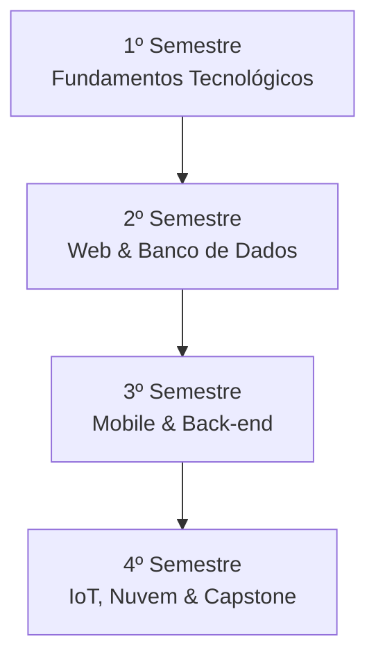

## Técnico em Desenvolvimento de Sistemas 🎓

Bem-vindo ao **Portal Técnico de Desenvolvimento de Sistemas**. Este é o repositório oficial de materiais de aula, roteiros de laboratório, planos de curso, tutoriais de configuração e critérios de avaliação do nosso curso.

Nossa grade é estruturada de forma a guiar sua formação técnica e acadêmica ao longo de **4 Semestres**, combinando fundamentos teóricos com a prática de mercado e autonomia de pesquisa.

---

### 🗺️ Trilha de Formação Profissional

Explore o foco de aprendizado de cada etapa da sua jornada:

#### <i className="fa-solid fa-laptop" style={{ color: '#3B82F6' }}></i> 1º Semestre — Fundamentos e Lógica
*   **Foco:** Raciocínio algorítmico, lógica de programação estruturada, redes de computadores, arquitetura de sistemas operacionais e levantamento de requisitos de software.
*   *Competência:* Compreender como os computadores organizam dados na memória e projetar as primeiras sequências lógicas de comandos.

#### <i className="fa-solid fa-code" style={{ color: '#10B981' }}></i> 2º Semestre — Desenvolvimento Web & Dados
*   **Foco:** Criação de interfaces web interativas e responsivas (HTML5, CSS3, JavaScript), programação orientada a objetos (POO) e modelagem de bancos de dados relacionais SQL.
*   *Competência:* Desenvolver aplicações front-end interativas que se conectam a bancos de dados estruturados locais.

#### <i className="fa-solid fa-mobile-screen-button" style={{ color: '#8B5CF6' }}></i> 3º Semestre — Mobile e Sistemas Complexos
*   **Foco:** Programação de aplicativos nativos e híbridos para dispositivos móveis com **React Native / Expo**, arquitetura de servidores e APIs RESTful (Node.js/Express) e gestão de projetos ágeis.
*   *Competência:* Construir aplicações mobile completas integradas com serviços em nuvem e fluxos modernos de navegação.

#### <i className="fa-solid fa-microchip" style={{ color: '#F59E0B' }}></i> 4º Semestre — Engenharia Avançada & IoT
*   **Foco:** Testes e qualidade de software, computação na nuvem, desenvolvimento de internet das coisas (IoT) integrado com microcontroladores e consolidação do Projeto Integrador Final.
*   *Competência:* Planejar, documentar, testar e implantar uma solução digital inovadora e escalável para problemas do mundo real.

---

> [!TIP]
> **Metodologia de Aprendizagem Ativa**
> Nossos materiais são focados na autonomia do estudante. Cada aula prática é estruturada para instigar a pesquisa e a tomada de decisão:
> 1.  **Objetivos de Aula:** Alinhados com competências técnicas de mercado.
> 2.  **Explicação Didática:** Apresentação conceitual focada no laboratório.
> 3.  **Exemplo Prático:** Código limpo, testado e comentado para demonstração.
> 4.  **Atividade Prática & Checklist:** Metas objetivas com etapas de entrega claras.
> 5.  **Desafio Final:** Incentivo à metacognição para explorar limites do próprio código.

---

### 📂 Central de Recursos Rápidos

Navegue facilmente pelos materiais complementares do portal:

*   📝 **[Critérios de Avaliação e Escalas de Cotejo](../avaliacoes/criterios-de-avaliacao.md):** Entenda as rubricas pedagógicas de notas de laboratório.
*   📖 **[Tutoriais de Instalação e Ambientes](../tutoriais/instalar-git.md):** Guias passo a passo para configurar Git, Expo, Node.js e Docker.
*   📂 **[Modelos de Projetos e Relatórios](../modelos/modelo-relatorio.md):** Templates prontos de documentação, relatórios e apresentações de projetos.
*   🚀 **[Diretrizes de Projetos Integradores](../projetos/projeto-tcc.md):** Desafios e diretrizes de Projetos Integradores de semestres anteriores.
